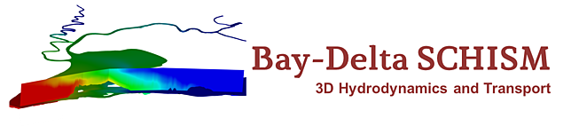

.. Bay-Delta SCHISM documentation master file, created by
   sphinx-quickstart on Fri Dec 05 22:53:35 2014.
   You can adapt this file completely to your liking, but it should at least
   contain the root `toctree` directive.

========================
Bay-Delta SCHISM Project
========================

Welcome! This is home base for the Bay-Delta SCHISM modeling project.

Bay-Delta SCHISM is an application of the 3D open source `SCHISM <http://ccrm.vims.edu/schismweb/>`_ :cite:p:`zhang_new_2015` :cite:p:`zhang_seamless_2016` hydrodynamic and water quality suite to the San Francisco Bay Delta estuary. The project is a collaboration between the California Department of Water Resources and the Virginia Institute of Marine Sciences (VIMS).

Project description
-------------------

The goal of our project is to develop an open-source, cross-scale multidimensional model suitable to answer flow and water quality questions involving large extents of the Bay-Delta system over periods of several years. Target applications include: 
 * Habitat creation and conveyance options under Delta Conveyance Project;
 * Evaluation of conveyance pathways through Clifton Court to minimize transit time for fish
 * Computation of Low Salinity Zone and preferred habitat metrics in Suisun Marsh as part of the DWR's Incidental Take Permit and associated long term operations agreements;
 * Salinity intrusion changes under drought or sea level rise; 
 * Salinity benefits, water age and velocity changes following the installation of drought barriers; 
 * Fate of mercury produced in the Liberty Island complex; 
 * Provision of high resolution velocity fields for agent based (ELAM) modeling as part of structured decision making to improve salmon migration through the Sacramento River/Steamboat Slough area.

These applications vary a great deal in scope. Some can be studied with our base model with a few quick adjustments, but the last two require focal regions of intense study, multi-disciplinary biogeochemistry, or more careful validation of a particular transport mechanism. In our collaboration with NOAA and NASA in the SESAME project, the flexibility and openness of SELFE (forebearer of SCHISM) allowed swift incorporation of CoSINE, an alternate nutrient model to the standard EcoSIM 2.0 emphasizing the most important constituents for salmon in the system. 

Our immediate goal has been to establish a foundation – to develop a sense of global accuracy, requiring that we resolve (or craftily under-resolve) the main mechanisms of hydrodynamics and transport up the estuary and in Delta channels. These include gravitational circulation and exchange flow; periodic stratification; axial convergence; tidal trapping; flood-ebb asymmetry of flow paths, shear dispersion, primary flow streamlines, and perhaps some secondary circulation in large channels. 

Although we expect our general calibration to continue to improve, further work will be focus on project-dependent enhancements. Due to its flexible mesh, the model is easily re-usable in a near field/far field arrangement whereby the base model provides a pre-calibrated background grid for an extension or focal region of study. 

An overview of the Bay-Delta application is given in the `workflow guide <_static/workflow_guide.pdf>`_. Note this guide alludes to the "working title" as SELFE transitioned to SCHISM, SELFE-W.

DSM2 runs in parallel with SCHISM to simulate the Sacramento–San Joaquin Delta (the Delta). DSM2 is a 1D model that runs quickly and is used as a complementary model to the 3D model SCHISM.

Necessary Software
------------------

You can find everything you need to know about the necessary software and python packages in `Installation and Getting Started <getstarted>`_. 

User Guide
-----------

The `User Guide <user_guide>`_ has detailed guides on how to set up and run the model after you have downloaded the required software. The user guide is meant for someone with a decent amount of modeling knowledge to get going with our Bay-Delta SCHISM model. If you are new to modeling in SCHISM you may want to start with `Hello SCHISM <hello_schism>`_ and then come back to the user guide when you are ready to get going with the Bay-Delta SCHISM model.

Learning Resources
-------------------

The `Learning Resources <learning>`_ has links to training materials and other resources for learning about hydrodynamic modeling with SCHISM. 

Calibration Report and References
---------------------------------

The `Calibration <calibration>`_ section has information on how we calibrated the model and when, as well as reports on the Bay-Delta SCHISM model and its' applications.

Contributing to the Documentation
----------------------------------

If you would like to contribute to this website, you can visit the `Documentation section <documentation>`_ to learn about `the best practices for Sphinx <doc_sphinx>`, see some `examples in Sphinx ReStrutured text <doc_sphinx>`_, `Mermaid diagrams and flow charts <doc_mermaid>`_, and `Click documentation principles <doc_click>`_. 

References
-----------

Finally, the `References <refs>`_ section has links to articles referenced in this website.

Contents
--------

.. toctree::
  :maxdepth: 2
  :hidden:

  self
  
.. toctree::
  :maxdepth: 2

  getmodel
  user_guide
  learning
  calibration
  documentation
  help
  refs

.. toctree::
  :maxdepth: 1

  bdschism python package <bdschism.rst>

Independent manual web pages are available for `VTools <http://cadwrdeltamodeling.github.io/vtools3/>`_ and 
DWR's Python-based SCHISM Toolset `schimpy <https://cadwrdeltamodeling.github.io/schimpy/>`_.

Indices and tables
==================

* :ref:`genindex`
* :ref:`modindex`
* :ref:`search`

