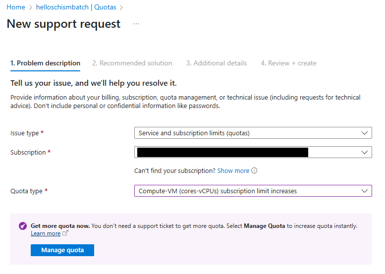

.. _azure:

================================================
Running on Azure Batch
================================================

Azure Batch is a cloud-based service that allows you to run large-scale parallel and high-performance computing applications. This section provides an overview of how to set up and run SCHISM on Azure Batch.

.. warning::

    This documentation is provided solely as guidance for using Azure Batch with SCHISM and related tools. The authors and organizations involved are not affiliated with, endorsed by, or in partnership with Microsoft Azure. No promotion or recommendation of Azure services is intended; Azure is referenced here only because it is the platform currently used for these workflows by DWR's Modeling Support Office.

.. _setup_azure:

Setup Azure 
---------------------

Download Azure Utilities
``````````````````````````````

Azure is a paid service separate from SCHISM, BayDeltaSCHISM, and CA-DWR. Once you have set up your Azure batch and storage accounts within your Azure resource group, you'll need to download a few things:

* `Azure CLI <https://learn.microsoft.com/en-us/cli/azure/?view=azure-cli-latest>`_
    * download and install on your machine to pass jobs (simulations) to Azure batch
    * this is likely a command line string that you'll run and re-launch a terminal
    * you can also use pip install azure-cli --upgrade after creating the azure environment in `download_dmsbatch`_
* `AzCopy <https://learn.microsoft.com/en-us/azure/storage/common/storage-use-azcopy-v10?tabs=dnf>`_
    * download and install on your machine to upload content to storage container
* `Azure Batch Explorer (desktop app) <https://azure.github.io/BatchExplorer/>`_
    * this isn't technically necessary, but is quite helpful in managing ongoing simulations
* `Azure Storage Explorer (desktop app) <https://azure.microsoft.com/en-us/features/storage-explorer/#overview>`_
    * again, not technically necessary, but quite useful

Setup can be done via az commands. Here we setup a batch account with associated storage.

Login
````````````````

Login with your Azure credentials in a console with admin access. 
    
    .. code-block:: console

        az login --use-device-code

Copy in the code from the console then go to https://microsoft.com/devicelogin and paste into the browser window to verify your credentials.

You may get a "certificate verify failed" message. If you are on a government network you may have firewall settings that restrict all SSL. You'll either need to talk to your IT personell or use a personal network.

To test that your login worked, use:

    .. code-block:: console

        az account show

This will show your account info.

Register with Azure
``````````````````````````

.. _console_vars:

Set Console Variables
:::::::::::::::::::::::

See the Azure docs for details. To use the commands below, enter your values (replacing the <angle brackets and values>) and export them to your console. You'll need to do this each time you open a new console, or you can set them in your .bashrc or .zshrc file.

    .. code-block:: console

        export MY_RG="<resourcegroupname>"
        export MY_LOCATION="<location_name>"
        export MY_STORAGE="<storage_account_name>"
        export MY_BATCH_ACCOUNT="<batchaccountname>"

For the --location, you can use any location, but eastus and westus2 is what DWR uses. For a whole list of all Azure locations see `this link <https://learn.microsoft.com/en-us/azure/reliability/regions-list>`_. 

For naming conventions: The storage account name typically ends in "sa", and the batch account typically ends in "batch" for ease of navigating resources on Azure. **You'll want your resource group, storage account, and batch account in the same region/location.**

Create Azure Accounts
:::::::::::::::::::::::::

    .. code-block:: console

        az group create --name $MY_RG --location $MY_LOCATION

        az storage account create --resource-group $MY_RG --name $MY_STORAGE --location $MY_LOCATION --sku Standard_LRS

        az batch account create --name $MY_BATCH_ACCOUNT --storage-account $MY_STORAGE --resource-group $MY_RG --location $MY_LOCATION


You can also create the batch account and associated account as `explained here <https://docs.microsoft.com/en-us/azure/batch/batch-account-create-portal>`_.

You may encounter some errors about regional quotas. **You'll want your resource group, storage account, and batch account in the same region/location.** So you may want to ensure that the machine type is available in your region before picking your resource group's location. To see what VM types are available in your region, use:

    .. code-block:: console

        az batch location list-skus --location westus2 | grep -i hb

where "hb" is the VM type that we typically use for SCHISM (as of writing this version of the support documentation - see `azure_dms_batch templates' default_config.yamls <https://github.com/CADWRDeltaModeling/azure_dms_batch/tree/main/dmsbatch/templates>`_ for the current uses) If you see no output, then that VM type is not available in that region.

Removing a Resource Group
::::::::::::::::::::::::::

To remove a resource group and all associated resources, use:

    .. code-block:: console

        az group delete --name <resource_group_name>

    .. warning::

        If you remove a resource group, all associated batch accounts, storage accounts, and data will also be permanently deleted.

.. _download_dmsbatch:
Download azure_dms_batch
````````````````````````````

Git clone the azure_dms_batch repository

    .. code-block:: console

        git clone https://github.com/CADWRDeltaModeling/azure_dms_batch.git

Navigate to the azure_dms_batch folder created above, and use the environment.yml with conda to create an environment called azure

    .. code-block:: console

        conda env create -f environment.yml

or *if you're not using conda*:

    .. code-block:: console

        pip install -r requirements.txt


Stay in the azure_dms_batch repo folder and then install using:

    .. code-block:: console

        conda activate azure
        pip install --no-deps -e .

For more information on the azure_dms_batch package, see the `README.md <https://github.com/CADWRDeltaModeling/azure_dms_batch/blob/main/README.md>`_ file.

.. _azure_upload_apps:

Upload Applications
---------------------

Azure batch requires the setup and installation to happen via zip files that are called application packages. The user should specify these packages with the version names as specified in the template. Here we will refer to the `alma87_mvapich2 template <https://github.com/CADWRDeltaModeling/azure_dms_batch/tree/main/dmsbatch/templates/alma87_mvapich2_20241018>`_.

The `app-packages/batch_app_package_and_upload.sh <https://github.com/CADWRDeltaModeling/azure_dms_batch/blob/main/app-packages/batch_app_package_and_upload.sh>`_ script can be used to upload the packages which you will do in the following steps.

SCHISM
`````````

For SCHISM, you'll need to either compile and zip the executables yourself, or you can refer to `the releases page <https://github.com/CADWRDeltaModeling/azure_dms_batch/releases>`_ and download the relevant **\schism_with_deps_\*.zip** file. For HelloSCHISM and BayDeltaSCHISM tutorials, we'll refer to `the latest schism release, schism_with_deps_5.11.1_alma8.7hpc_v4_mvapich2.zip <https://github.com/CADWRDeltaModeling/azure_dms_batch/releases/download/schism_5.11_alma8.7/schism_with_deps_5.11.1_alma8.7hpc_v4_mvapich2.zip>`_. You'll also need `the latest alma release, nfs_alma8.7 <https://github.com/CADWRDeltaModeling/azure_dms_batch/releases/download/schism_5.11_alma8.7/nfs_alma8.7.zip>`_.

Save the .zip file to your local azure_dms_batch repository under azure_dms_batch/app-packages.

Now use `app-packages/batch_app_package_and_upload.sh <https://github.com/CADWRDeltaModeling/azure_dms_batch/blob/main/app-packages/batch_app_package_and_upload.sh>`_ to upload in the command line.

Use the export variables like MY_BATCH_ACCOUNT etc before using these commands (guidance :ref:`console_vars`):

    .. code-block:: console

        cd <path-to-azure_dms_batch>/app-packages

        source batch_app_package_and_upload.sh
        
        package_and_upload_telegraf "telegraf" $MY_BATCH_ACCOUNT $MY_RG
        package_and_upload_app schism_with_deps 5.11.1_alma8.7hpc_v4_mvapich2 schism_with_deps_5.11.1_alma8.7hpc_v4_mvapich2.zip  $MY_BATCH_ACCOUNT $MY_RG
        package_and_upload_app nfs alma8.7 nfs_alma8.7.zip  $MY_BATCH_ACCOUNT $MY_RG
        package_and_upload_batch_setup "../schism_scripts/" $MY_BATCH_ACCOUNT $MY_RG

Python Packages
```````````````

For python packages like schimpy and BayDeltaSCHISM's bdschism you can also use the **batch_app_package_and_upload.sh** script to upload the packages to your batch account.


    .. code-block:: console

        cd <path-to-azure_dms_batch>/app-packages

        source batch_app_package_and_upload.sh

        package_and_upload_schimpy $MY_BATCH_ACCOUNT $MY_RG
        package_and_upload_bdschism $MY_BATCH_ACCOUNT $MY_RG

The above utility names the package with *today's date* and then uploads it and sets it to the default version.

You can check the versions of packages and which is considered the default by going to the online `Azure Portal <https://portal.azure.com/>`_ and navigating to your batch account. Once in your batch account, navigate to Features \> Applications. There you'll see th application IDs as well as the default version that's being used.

If you were to want to upload a development or updated version of any of these packages you could use a similar approach to the package_and_upload techniques, and then use the online portal to specify the default version.

.. _azcopy_info:

File Transfer Commands
----------------------

azcopy commands
````````````````

The basic syntax of azcopy to copy local to Azure is:

    .. code-block:: console

        azcopy copy "<local_directory>" "<azure_storage_account/blob_container>/?<sas_link>"

and for Azure to local:
    .. code-block:: console

        azcopy copy "<azure_storage_account/blob_container>/?<sas_link>" "<local_directory>"

But at the Delta Modeling Section we most often use something like:

    .. code-block:: console

        export AZLINK="https://<storage_account>.blob.core.windows.net/<blob_storage_container/"
        export sas="<sas_link>"

        azcopy copy "<local_directory>" "${AZLINK}<blob_storage_container>/?${sas}" --exclude-regex="outputs/.\*nc" --recursive --preserve-symlinks --dry-run

where:

* **local_directory** 
    * whatever local path to your simulation directory you're uploading
* **storage_account** 
    * name of your Storage Account through Azure (not the same as the Batch Account name)
* **blob_storage_container**
    * folder path to your blob storage container
    * this will look like a folder path (eg: project_name/simulations/)
* **sas_link** 
    * SAS permissions key (generated each day for security)

.. _azuresas:

Generating SAS Links
:::::::::::::::::::::

    * you can generate and copy the SAS key by navigating to your storage account in the `Azure Portal <https://portal.azure.com/>`_ \> going to "Containers" 
    * Click on the three dots to the right of your blob container \> Generate SAS 
    * On the "Permissions" drop-down: click all boxes 
    * Click "Generate SAS token and URL"
    * copy the "Blob SAS token option"

azcopy options
```````````````
These are some of the most frequently used azcopy flag options:

* **--dry-run** 
    * this is useful to test your command before running
    * this flag prints a list of which files will be copied where without actually uploading/downloading anything
* **--recursive**
    * this will copy all files in all subdirectories
* **--preserve-symlinks**
    * any symbolic links will be preserved in the upload to the blob container
* **--include-regex**
    * use a Regular Expression to limit which files are included in the upload
    * ex: --include-regex="\suisun_\(2\|3\|7\)/.\*\;baseline_6/.\*\"
        * this would upload all folder contents of
            * suisun_2/
            * suisun_3/
            * suisun_7/
            * baseline_6/
        * The **.\*** string signifies "all contents"
* **--exclude-regex**
    * use a Regular Expression to determine which files are excluded in the upload
    * this is particularly useful for things like outputs \*.nc files and sflux \*.nc files which are very large and costly to upload
    * ex: --exclude-regex="outputs.\*/.\*nc;sflux/.\*nc"
        * this would exclude any files that end in "nc" that are found in the sflux, outputs, or outputs\* folders

.. _batch_quota:

Ensure Batch Quota
-------------------

You'll need to go to the Azure portal, to your batch account, and then to Settings /> Quotas.

From here you'll want to click "Request Quota Increase". Then you'll do the following to get this message to "Manage Quota".


   
   Batch quota request fields to get to "Manage Quota"

From here, you'll want to increase the quota for HBv2 Series to approximately 300. That should be enough for a HelloSCHISM tutorial run.

If your region doesn't support HBv2 or you have any deeper issues with Azure, you may need to consult with your IT support. Anything that isn't covered on this page is not within the scope of the HelloSCHISM or BayDeltaSCHISM tutorial realm.

References
-----------

`Python SDK Setup <https://docs.microsoft.com/en-us/azure/developer/python/azure-sdk-overview>`_
`BlobStorage Python Example <https://github.com/Azure/azure-sdk-for-python/tree/main/sdk/storage/azure-storage-blob>`_
`Azure Batch Python API <https://docs.microsoft.com/en-us/python/api/overview/azure/batch?view=azure-python>`_
`Azure Batch Python Samples <https://github.com/Azure-Samples/azure-batch-samples/tree/master/Python>`_
`Azure Batch Shipyard <https://github.com/Azure/batch-shipyard>`_

MPI specific
`Azure Batch MPI <https://docs.microsoft.com/en-us/azure/batch/batch-mpi>`_
`Cluster configuration options <https://docs.microsoft.com/en-us/azure/virtual-machines/sizes-hpc#cluster-configuration-options>`_

Intel MPI
`Azure settings for Intel MPI <https://docs.microsoft.com/en-us/azure/virtual-machines/workloads/hpc/setup-mpi#intel-mpi>`_
`Intel MPI Pre-requisites <https://www.intel.com/content/www/us/en/develop/documentation/mpi-developer-guide-linux/top/installation-and-prerequisites/prerequisite-steps.html>`_
