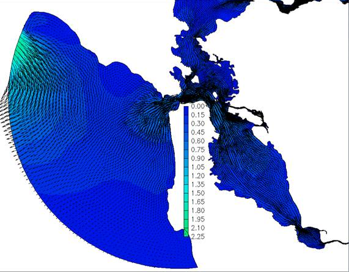

.. _barotropic:

###############################################
Ocean Boundary Stabilization: Barotropic Warmup
###############################################

Introduction
============

This section describes some issues with the a common practice with Bay-Delta SCHISM: a barotropic warmup run. 

The idea and potential need for a barotropic warm up harks to the well-posedness of the hydrostatic, layered 3D-equations,
the mainstay of estuarine circulation models. The pertinent reference is :cite:p:`oliger_theoretical_1978`. 
The idea is that we are allowed one boundary condition per "incoming characteristic". For transport of tracers (salinity, temperature, etc) this is the same as one boundary condition per incoming flow. 
This has a very intuitive feel -- we can only specify concentrations for flows
directed into the computational domain. For baroclinic hydrodynamics using layered equations, the number of
boundary conditions is potentially infinite, time varying, and discretization dependent. 

The upshot is that we have two choices for the ocean boundary. We can choose to clamp only water levels, 
which is underspecified and potentially allows baroclinic modes to "flare up" (:numref:`flareup`) if the model is not diffusive enough. Or we can specifiy velocity, which is in general overdetermined, and this potentially stabilizes the boundary. 

There are two methods of specifying velocity that have been used with the Bay-Delta SCHISM model:

  * force the model using estimates from a coastal open model such as the West Coast Forecasting System. 
  * do a preliminary 2D barotropic run and harvest boundary values from that. 

The coastal model solution makes sense in some operational scenarios, which focus on recent and observable scenarios. The alternative barotropic-baroclinic solution is widely used in Bay-Delta SCHISM, as it applies to hypothetical hydrologies landscape change
and sea level rise.

.. _flareup:

   
   Velocity flareup right near boundary due to stimulation of baroclinic modes.

Workflow
========

The barotropic warmup run is done with these steps:

  #. Linking `param.nml` to `param.nml.tropic`, `bctides.in` to `bctides.in.2d` and `vgrid.in` to `vgrid.in.2d`. So for instance in the case of param.nml: `ln -d param.nml.tropic param.nml`
  #. Make sure the start time and length (`rnday`) is the same as your period.
  #. Adjust the number of processors. You rarely want more than 96 processors for a barotropic run. It not only won't scale, it may degrade performance. 
  #. Run the run.
  #. Run the `interpolate_variables` script (see below) to interpolate the velocity output to the 3d grid. This creates the file `uv3D.th.nc` which contains velocities for the ocean boundary. This is the only product we really want from the barotropic run, although running it is also a cheap way of discovering issues.
  #. Move the `outputs` to `outputs.tropic` and create an empty `outputs` directory for the 3D run. You don't need to keep this forever if you have your uv3D.th.nc, but we typically keep it around for a while.
  
The baroclinic follow on is done with these steps:
  #. Linking `param.nml` to `param.nml.clinic`, `bctides.in` to `bctides.in.3d` and `vgrid.in` to `vgrid.in.3d`. So for instance in the case of param.nml: `ln -d param.nml.clinic param.nml`.
  #. Make sure you have the required nudging and hotstart files. 
  #. Check the run dates and make sure `ihot=1` (start using a hotstart file rather than coldstart). 
  #. Run the simulation.
  
Note that technically you do not have to have `hotstart.in.nc` or the nudging files ready for the barotropic run. They only come into play for the baroclinic step.

bctides.in
^^^^^^^^^^

param.nml
^^^^^^^^^

vgrid.in
^^^^^^^^

Run interpolate_variables to get uv3D.th.nc
-------------------------------------------

Move the outputs directory aside
--------------------------------

