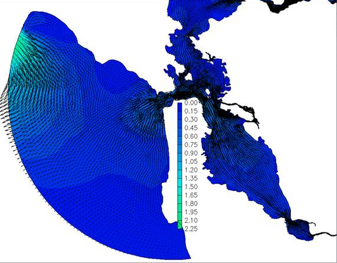

.. _barotropic:

############################################################
Ocean Boundary Stabilization: Barotropic Warmup (uv3D.th.nc)
############################################################

Introduction
============

This section describes some issues with the a common practice with Bay-Delta SCHISM: a barotropic warmup run. 

The idea and potential need for a barotropic warm up harks to the well-posedness of the hydrostatic, layered 3D-equations,
the mainstay of estuarine circulation models. The pertinent reference is :cite:p:`oliger_theoretical_1978`. 
The idea is that we are allowed one boundary condition per "incoming characteristic". For transport of tracers (salinity, temperature, etc) this is the same as one boundary condition per incoming flow. 
This has a very intuitive feel -- we can only specify concentrations for flows
directed into the computational domain. For baroclinic hydrodynamics using layered equations, the number of
boundary conditions is potentially infinite, time varying, and discretization dependent. 

The upshot is that we have two choices for the ocean boundary. We can choose to clamp only water levels, 
which is underspecified and potentially allows baroclinic modes to "flare up" (:numref:`flareup`) if the model is not diffusive enough. Or we can specifiy velocity, which is in general overdetermined, and this potentially stabilizes the boundary. 

There are two methods of specifying velocity that have been used with the Bay-Delta SCHISM model:

  * force the model using estimates from a coastal open model such as the West Coast Forecasting System. 
  * do a preliminary 2D barotropic run and harvest boundary values from that. 

The coastal model solution makes sense in some operational scenarios, which focus on recent and observable scenarios. The alternative barotropic-baroclinic solution is widely used in Bay-Delta SCHISM, as it applies to hypothetical hydrologies landscape change
and sea level rise.

.. _flareup:

   
   Velocity flareup right near boundary due to stimulation of baroclinic modes.

Workflow
========

The barotropic warmup run is done with these steps:

  #. Linking `param.nml` to `param.nml.tropic`, `bctides.in` to `bctides.in.2d` and `vgrid.in` to `vgrid.in.2d`. So for instance in the case of param.nml: `ln -d param.nml.tropic param.nml`
  #. Make sure the start time and length (`rnday`) is the same as your period.
  #. Adjust the number of processors. You rarely want more than 96 processors for a barotropic run. It not only won't scale, it may degrade performance. 
  #. Run the run.
  #. Run the `interpolate_variables` script (see below) to interpolate the velocity output to the 3d grid. This creates the file `uv3D.th.nc` which contains velocities for the ocean boundary. This is the only product we really want from the barotropic run, although running it is also a cheap way of discovering issues.
  #. Move the `outputs` to `outputs.tropic` and create an empty `outputs` directory for the 3D run. You don't need to keep this forever if you have your uv3D.th.nc, but we typically keep it around for a while.
  
The baroclinic follow on is done with these steps:
  #. Linking `param.nml` to `param.nml.clinic`, `bctides.in` to `bctides.in.3d` and `vgrid.in` to `vgrid.in.3d`. So for instance in the case of param.nml: `ln -d param.nml.clinic param.nml`.
  #. Make sure you have the required nudging and hotstart files. 
  #. Check the run dates and make sure `ihot=1` (start using a hotstart file rather than coldstart). 
  #. Run the simulation.
  
Note that technically you do not have to have `hotstart.in.nc` or the nudging files ready for the barotropic run. They only come into play for the baroclinic step.

bctides.in
^^^^^^^^^^
Symlink your bctides file to bctides.in.3d for baroclinic run and bctides.in.2d for barotropic run.

param.nml
^^^^^^^^^
Symlink your param.nml file to param.nml.clinic for baroclinic run and param.nml.tropic for barotropic run.

vgrid.in
^^^^^^^^
Symlink your vgrid.in file to vgrid.in.3d for baroclinic run and vgrid.in.2d for barotropic run.

.. note::
   It's helpful to move your barotropic results before starting the baroclinic run:

   .. code-block:: console

      mv outputs outputs.tropic
      mkdir -p outputs

   The following utilities will automatically look for the barotropic outputs in `outputs.tropic` and the baroclinic outputs in `outputs`. This is not strictly necessary, but it helps avoid confusion and mistakes.

.. _gen_uv3d:

Generate uv3D.th.nc
---------------------
Both methods described below use the SCHISM utility ``interpolate_variables`` to interpolate
2D barotropic velocity output onto the 3D grid, producing ``uv3D.th.nc``.

Simple method
^^^^^^^^^^^^^
The simplest approach is the bdschism utility ``bds uv3d``, which runs the full interpolation
in a single call with no required arguments (run from the barotropic simulation directory):

.. code-block:: console

    bds uv3d

This is convenient but processes all output files serially, which can take hours for long runs.

Batch method (SLURM)
^^^^^^^^^^^^^^^^^^^^
For much faster generation, use the SLURM array script that drives ``bds uv3d_single``.
Each array task independently processes one netCDF output stack (typically one day, as set
by ``dt`` and output frequency in ``param.nml``), so the entire run completes in roughly the
time of a single file rather than the sum of all files.

**Background and foreground directories**

The script distinguishes two simulation directories that can be anywhere relative to each other:

* **Background** (``BG_DIR``) — the barotropic (source) simulation. Velocity output files and
  the 2D vgrid are read from here.
* **Foreground** (``FG_DIR``) — the baroclinic (destination) simulation. The 3D vgrid and
  hgrid that define the target grid are taken from here. Output files are written here.

Unlike ``bds uv3d``, each task performs its work in a temporary directory created inside
``BG_DIR`` (``BG_DIR/tmp_outputs_<TASKID>``), keeping the barotropic outputs untouched.

**How each task "lies about time"**

``interpolate_variables`` expects to process stack files numbered from 1. Each SLURM task
tricks it by symlinking the single file for its task index to ``*_1.nc`` names, then invoking
the utility with ``nday=1``. The result is a ``uv3d.th.nc`` whose internal timestamps reflect
only that one day's data; the correct absolute times are restored when the files are combined
in the post-processing step.

**Per-task workflow**

For task ``N`` the script:

1. Creates ``BG_DIR/tmp_outputs_N``
2. Symlinks the four required netCDF files from the barotropic outputs into the temp directory, renaming them to ``*_1.nc``
3. Symlinks the grid files (``bg.gr3``, ``fg.gr3``, ``vgrid.bg``, ``vgrid.fg``) into the temp directory
4. Runs ``interpolate_variables`` (``nday=1``) in the temp directory
5. Moves the result to ``FG_OUT_DIR/uv3d_N.th.nc``
6. Removes the temp directory

See the `example SLURM script <https://github.com/CADWRDeltaModeling/BayDeltaSCHISM/blob/master/examples/uv3d_batch/batch_create_uv3d.slurm>`_
for the configuration variables (``BG_DIR``, ``FG_DIR``, vgrid/hgrid filenames, output directory)
that are set at the top of the file before submitting.

**Combining the per-file outputs**

Once the array job completes, combine the individual files into a single continuous
``uv3D.th.nc`` using:

.. code-block:: console

    bds combine_nc uv3d

or, to select a specific range:

.. code-block:: console

    bds combine_nc ./uv3d/uv3d_*.th.nc 1 100 -o uv3d.combined.th.nc

Then symlink ``uv3D.th.nc`` in the baroclinic run directory to the combined file.
The intermediate per-file outputs can be deleted once the combined file is verified.

