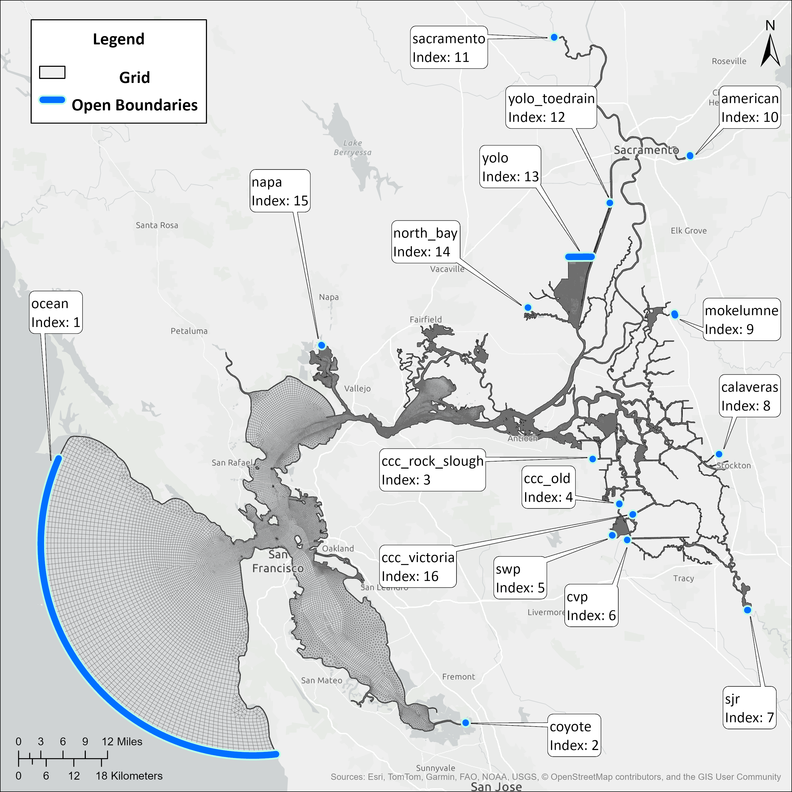

=====================================
Bay Delta Boundaries
=====================================

.. _open_boundary_grid:  

   
   Open Boundaries to the Bay Delta SCHISM model with indices corresponding to the bctides.in file order, which is how SCHISM then indexes those boundaries 

Generally speaking, all inflows have negative signs in flux.th and all outflows have positive signs. See table for references to input files and descriptions of the boundaries. 
Note that the ocean boundary is a special case, as it has both elevation and velocity inputs in the baroclinic mode, and the velocity inputs are derived from a barotropic warmup run. See :ref:`barotropic` for more details on that process.
   
.. list-table:: Bay-Delta SCHISM Open Boundaries
  :header-rows: 1
  :class: right-align-first-col
  :widths: 5 12 11 12 20 40

  * - Index
    - Boundary Name
    - Type
    - Sign in File
    - Input File
    - Description
  * - 0
    - ocean
    - elevation (**and** velocity in baroclinic mode)
    - Up is Positive
    - elev2d.th.nc (**and** uv3d.th.nc in baroclinic mode)
    - Ocean tidal inputs derived from Point Reyes and Monterey tidal stations
  * - 1
    - coyote
    - flow 
    - Negative
    - flux.th
    - Coyote Creek just north of Milpitas
  * - 2
    - ccc_rock_slough
    - flow
    - Positive
    - flux.th
    - Exports taken by Contra Costa Water District (CCWD) at Rock Slough Intake
  * - 3
    - ccc_old
    - flow
    - Positive
    - flux.th
    - Exports taken by CCWD at Old River Intake
  * - 4
    - swp
    - flow
    - Positive
    - flux.th
    - Exports taken by State Water Project (SWP) at Banks Pumping Plant
  * - 5
    - cvp
    - flow
    - Positive
    - flux.th
    - Exports taken by Central Valley Project (CVP) at Jones Pumping Plant
  * - 6
    - calaveras
    - flow
    - Negative
    - flux.th
    - Calaveras River in Stockton just East of Interstate 5
  * - 7
    - sjr
    - flow
    - Negative
    - flux.th
    - San Joaquin River at Vernalis, just downstream of confluence with Stanislaus River
  * - 8
    - mokelumne
    - flow
    - Negative
    - flux.th
    - Mokelumne River downstream of confluence with Cosumnes River
  * - 9
    - american
    - flow
    - Negative
    - flux.th
    - American River near Watte Ave bridge
  * - 10
    - sacramento
    - flow
    - Negative
    - flux.th
    - Sacramento River flow above Verona, includes interpolated flow from Feather River
  * - 11
    - yolo_toedrain
    - flow
    - Negative
    - flux.th
    - Flow into the Toe Drain of the Yolo Bypass, upstream of the Lisbon Weir
  * - 12
    - yolo
    - flow
    - Negative
    - flux.th
    - Flood flows from Yolo Bypass, includes Putah Creek, Willow Slough, Cache Creek, and flows from Sacramento River from Knights Landing Ridge Cut as well as from overtopping Fremont and Sacramento Weirs
  * - 13
    - north_bay
    - flow
    - Positive
    - flux.th
    - Exports through the North Bay Aqueduct Intake at Barker Slough
  * - 14
    - ccc_victoria
    - flow
    - Positive
    - flux.th
    - Exports taken by CCWD from Victoria Canal (Middle River Pump Station)