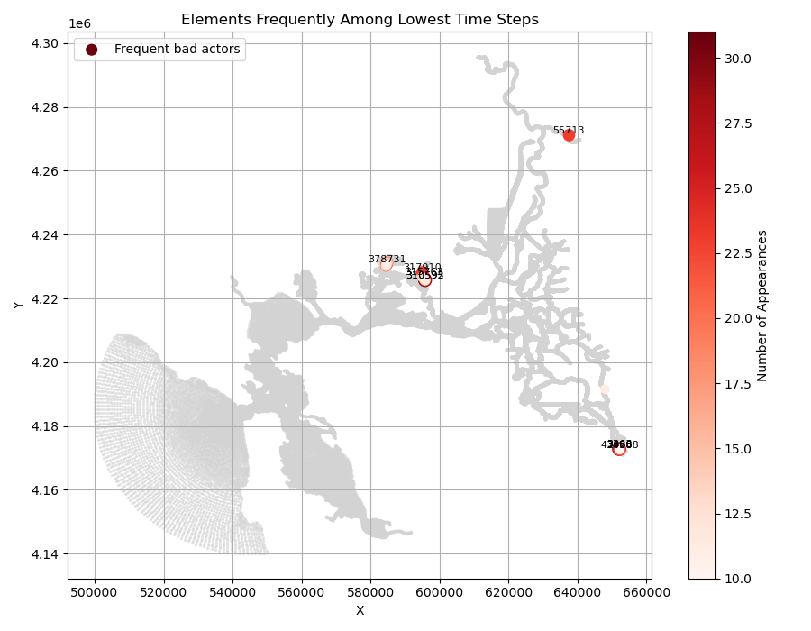

.. |cbox|   unicode:: U+2610

==============================
Gridding the Horizontal Mesh
==============================

The format of the SCHISM horizontal mesh is described in the `SCHISM manual <https://schism-dev.github.io/schism/master/index.html>`_. 

Users will find that SCHISM projects require refinement or extension. There are a few reasons:

- SCHISM modeling is often used for 
  
  - focused analysis, requiring refinement
  
  - sea level rise, requiring upstream extension or gridding of exposed areas.
  
  - restoration areas.
  
- The spatial parameterization is varied or parameterized, so there is no extensive "calibration" of a new mesh  

Here we will cover:

- Best practices for horizontal gridding

- Attaching boundaries

- :ref:`Checklist <change_mesh>` for after changing the grid or boundaries.

- Vertical grid.

.. contents:: Table of Contents
   :depth: 2
   :local:
   :backlinks: none

Meshing
-------

Meshing considerations for SCHISM
^^^^^^^^^^^^^^^^^^^^^^^^^^^^^^^^^^^^^^^^^^^^^^^

Video (Joseph Zhang, SCHISM summit)
"""""""""""""""""""""""""""""""""""

Video (Joseph Zhang #2)

Recap/checklist
"""""""""""""""

Getting to know SMS
^^^^^^^^^^^^^^^^^^^
Please see Aquaveo `SMS learning center`_ for videos, tutorials, wiki, courses, and blog.
The CA-DWR Delta Modeling Section has posted a series of videos to be used for learning how to use SMS for SCHISM mesh generation. You can see the complete playlist here: `DMS SCHISM Gridding Playlist`_

.. _SMS learning center: https://aquaveo.com/software/sms/learning
.. _DMS SCHISM Gridding Playlist: https://youtube.com/playlist?list=PL33EJkVWqElUYwUVwoPJNbxncPytpAI_2&si=dBTzI4PUWRE_Avb3

Here's the introductory SMS video by Eli Ateljevich:

.. raw:: html

  

        <iframe src="https://www.youtube.com/embed/Ez7Fz6thXGM?si=NmJZgPD8cp8dxef6" title="SMS Mesh Generation Principle" frameborder="0" allowfullscreen style="position: absolute; top: 0; left: 0; width: 100%; height: 100%;"></iframe>
  

Sample Data
""""""""""""

Recap checklist
"""""""""""""""

Presentation: clip_dems and efficient use of DEMS
"""""""""""""""""""""""""""""""""""""""""""""""""

Building the Bay-Delta mesh the standard way
^^^^^^^^^^^^^^^^^^^^^^^^^^^^^^^^^^^^^^^^^^^^
Here's the SMS 2dm generation overview video by Eli Ateljevich:

.. raw:: html

  

        <iframe src="" title="DMS Bay Delta official mesh building" frameborder="0" allowfullscreen style="position: absolute; top: 0; left: 0; width: 100%; height: 100%;"></iframe>
  

Presentation: Meshing consideration for marshes and restoration
^^^^^^^^^^^^^^^^^^^^^^^^^^^^^^^^^^^^^^^^^^^^^^^^^^^^^^^^^^^^^^^

Merging/Stitching SMS mesh/maps (new work, flooded islands, etc)
^^^^^^^^^^^^^^^^^^^^^^^^^^^^^^^^^^^^^^^^^^^^^^^^^^^^^^^^^^^^^^^^

Video
"""""

Recap/checklist
"""""""""""""""

Vertical mesh setup
-------------------

.. _change_mesh:

Checklist for after you change the mesh
---------------------------------------

Changing the mesh tends to have consequences in places people forget to think about, though most are
straightforward or obvious. This is a checklist of gotchas that arise outside the gridding environment.

|cbox| Are boundaries still in the proper place?

|cbox| If boundaries moved, is depth enforcement preventing dry boundaries still in right place?

|cbox| Are flow cross sections in changed area still aligned?

|cbox| Are the node pairs that define hydraulic structure locations still correct?

|cbox| Are polygons used to define spatial inputs appopriate for new area?

|cbox| If grid was extended, do yaml polygons cover extended domain?

|cbox| Are sources excluded?

|cbox| Do you have submerged aquatic vegetation? Assumptions? Consider changing those file

|cbox| Old hotstarts not valid on new mesh, utilities will interpolate on new grid

|cbox| Old nudging files not valid on new mesh. Re-do.

|cbox| If refining/coarsening extensively on main channel, consider the effect on momentum and the algorithm.

|cbox| Mesh quality:

    |cbox| Skew and area warnings in preprocessor. 

Performance Tuning
------------------

Changes in the horizontal mesh have the potential to create elements with small volume and fast velocities. 
Courant–Friedrichs–Lewy (CFL) condition for tracer transport will then trigger subcycling that will control 
the global performance of the model. Scaling and parallelism won't help.   

The first step in fixing this is to find the problem. The analyze_dt utility is intended to 
help diagnose which elements limit the global time step of the model. In pathological cases on a 
well-tended grid, a handful of elements are usually to blame. However, because a single bad element can control
the time stepping of the entire model you do have to get them all.

Once you know identify bad actors, the following fixes may help:

* Increase element size. 
* Add a small patch of emergent pseudo vegetation to create drag through the entire water column rather than shear from the bottom. Drag penalizes the square of velocity and will tap down flareups.
* Coarsen the vertical mesh locally.
* Convert triangles to quads.
* Use elevation enforcement along the thalwag, which provides some smoothing.

.. _analyze-dt:

The analyze_dt Utility
^^^^^^^^^^^^^^^^^^^^^^^^^

.. note::
    To use this utility, you must run SCHISM with a build that includes the ANALYSIS module and ensure output for minTransportTimeStep is enabled in your model configuration (`param.nml`). The variable will appear in out2d_[#].nc

The analyze_dt utility is a subcommand within the bds command-line tool. It provides several tools to help identify and visualize elements in a SCHISM model domain that impose small transport time steps (minTransportTimeStep) during simulations. This is useful for debugging and mesh refinement, especially where subcycling might be triggered.

This utility is available as a subcommand:

.. code-block:: console

    bds analyze_dt [COMMAND] [OPTIONS]

Available Commands

dist
  Plot a cumulative distribution function (CDF) of time steps.

  Example:

  .. code-block:: console

    bds analyze_dt dist out2d_21.nc --file_step 5

hist
  Plot a histogram focusing on the lower end of time steps.

  Example:

  .. code-block:: console

    bds analyze_dt hist out2d_21.nc --file_step 5

list
  List the N elements with the smallest time steps at a given output step within the file.

  Example:

  .. code-block:: console

    bds analyze_dt list out2d_21.nc --file_step 3 --n 20

  Sample Output::

    ndx,el,x,y,dt
    0,315764,595402.84,4226879.11,1.731465
    1,310596,595791.67,4225754.48,1.749715
    ...

plot
  Plot the spatial distribution of transport time steps, highlighting the lowest N.

  Example:

  .. code-block:: console

    bds analyze_dt plot out2d_21.nc --file_step 2 --n 20

summarize
  Analyze and optionally plot elements that frequently appear among the lowest N time steps across all output times.

  Options:

    * summarize: Top N elements to track each timestep

    * --num: Minimum number of appearances required to be included

    * --plot: Flag to show a spatial plot

    * --csv_out FILE: Save results to CSV

    * --label_top K: Label top K offenders (default: all)

Example:

.. code-block:: console

  bds analyze_dt summarize out2d_21.nc --summarize 20 --num 10 --plot --csv_out dt_summary.csv

This example summarizes elements that appear among the 20 worst offenders per time step
for at least 10 time steps. 
The output includes the (0-based) element number, count of times in this role and location.

Sample Text Output:

.. code-block:: text

  el,count,x,y
  3363,31,652052.58,4172820.80
  310595,31,595791.67,4225754.48
  ...

	
    **Figure** Example plot of 20 elements with smallest subcycling time steps

