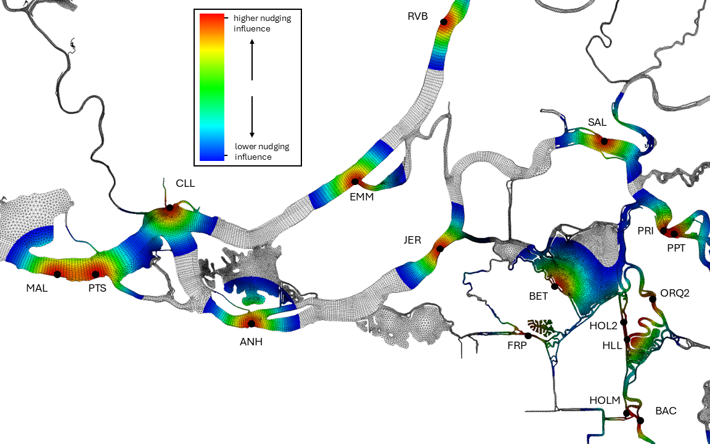
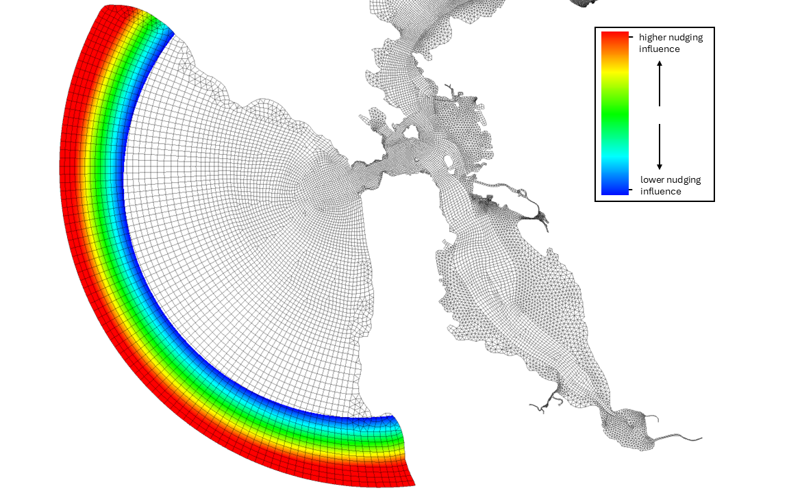

.. _nudging:

=============  
Nudging Files  
=============  

Introduction: What is nudging?  
------------------------------  

.. _nudge_obs_grid:  

   
   Nudging relaxation shown around EC and temperature stations. Red shows where the nudging is applied the greatest, Blue is the least, and White induces no nudging. The relaxation constants are specified in the [MOD]_nudge.gr3 file. The locations and values are specified in the \*.yaml files.  

.. _nudge_ocean_grid:  

   
   Nudging relaxation shown along the ocean boundary. Similar color scale to Fig. :numref:`nudge_obs_grid`. Also the stations used to interpolate along the ocean boundary are specified in the \*.yaml files.  

In SCHISM you can use a NetCDF file that coerces/nudges module values towards an observed or set timeseries in specific points throughout the model.  
You can see the param.nml settings in the nudging block::  

    inu_tr(1) = 2 !T  
    inu_tr(2) = 2 !S  
    inu_tr(3) = 0 !GEN  
    inu_tr(4) = 0 !Age  
    inu_tr(5) = 0 !SED3D  
    inu_tr(6) = 0 !EcoSim  
    inu_tr(7) = 0 !ICM  
    inu_tr(8) = 0 !CoSINE  
    inu_tr(9) = 0 !FIB  
    inu_tr(10) = 0 !TIMOR  
    inu_tr(11) = 0 !FABM  

    vnh1 = 400 !vertical nudging depth 1  
    vnf1 = 0. !vertical relax \in [0,1]  
    vnh2 = 500 !vertical nudging depth 2 (must >vnh1)  
    vnf2 = 0. !vertical relax  

    step_nu_tr = 3600. !time step [sec] in all [MOD]_nu.nc (for inu_[MOD]=2)  

Where `inu_tr(N)` is set to 2 if a NetCDF file is used to nudge values for that module, and set to 0 if no nudging is used. For instance temperature (N=1) or salinity (N=2) are most often set to 2, and require `[MOD]_nu.nc` as well as `[MOD]_nudge.gr3` as inputs. The .nc file specifies the values to be nudged to, and the .gr3 file specifies the horizontal relaxation constants, which are applied with the vertical nudging relaxation specified by a linear function of `vnh[1,2]` and `vnf[1,2]`. We typically use one hour nudging (3600) which is needed if using data with relatively fast nudging rates.

Do I need nudging?  
------------------  
Nudging is used for two purposes:  
1. Initialization: fast spin-up over brief period using observations over the whole domain  
2. Soft coastal boundary enforcement  

It is common for a single simulation to start and finish with different nudging products. Typically, the first nuding is dense, utilizing data from many observation stations, and is used to spin up the model quickly. The second is intended to only provide coastal data.  

The soft coastal boundary enforcement is applied by providing temperature and salinity values close to the model boundary. This prevents conspicuous boundary layer from forming at the ocean boundary. The temperature and salinity values are obtained from coastal modeling products, such as HYCOM, CeNCOOS, or ROMS. In general, the choice between these is based on their period of availabiltiy: for runs after 2020. The other products are available for prior years.  

See Chapter 5 in `Methodology for Flow and Salinity Estimates <https://data.cnra.ca.gov/dataset/methodology-for-flow-and-salinity-estimates-in-the-sacramento-san-joaquin-delta-and-suisun-marsh/resource/8f6bb786-60e6-44cc-847e-37cea36f8c2b>`_ for more detail.  

Generating nudging files  
-----------------------------  
The python function to generate nudging files is `create_nudging`, which is part of `schimpy <https://github.com/CADWRDeltaModeling/schimpy/blob/master/schimpy/nudging.py>`_. The function is run as follows::  

    create_nudging --input config_file

.. currentmodule:: schimpy.nudging
.. autoclass:: Nudging
   :members: create_nudging

Here, `config_file` is in yaml format, examples of which can be found in the `BayDeltaSCHISM examples/nudging folder <https://github.com/CADWRDeltaModeling/BayDeltaSCHISM/tree/master/examples/nudging>`_

Preparing for nudging with observation data  
-------------------------------------------- 

For nudging using observtion data, one must prepare the time series inputs using `hotstart_nudging_data from BayDeltaSCHISM <https://github.com/CADWRDeltaModeling/BayDeltaSCHISM/blob/master/bdschism/bdschism/hotstart_nudging_data.py>`_.  

The start date, length of nudging, and the location of the time series files need to be specified in the following manner:  
`bds hot_nudge_data --start_date 2021-01-01 --nudge_len 10 --repo_dir $repo`, where `$repo` is the path to raw observation data.  

The recommended spin-up period using observation data is 10-15 days.  

Nudging Example  
-----------------  
For Bay-Delta applications for simulation period of 2020 or later, a two-step process of nudging is recommended:  

First, nudge the internal domain with a mix of observed data and for the first 10-15 days of the simulation (spin-up), followed by nudging close to the ocean boundary using data from coastal modeling products.  

Below is an example of nudging a Bay-Delta simulation spanning from 2021-01-01 to 2021-01-31:  

1. Prepare for observation-based nudging by running `hotstart_nudging_data <https://github.com/CADWRDeltaModeling/BayDeltaSCHISM/blob/master/bdschism/bdschism/hotstart_nudging_data.py>`_ like so:
 
    .. code-block:: console

        bds hot_nudge_data --start_date 2021-01-01 --nudge_len 10 --dest_dir . --repo_dir "/scratch/nasbdo/modeling_data/repo/continuous/screened/"

    Here, the command is specifying that the start date of the simulation is 2021-01-01, and that the observed data will be used for nudging length of 10 days. The destination directory is the current working directory ("."), and the location of observed data can be found in the path following "--repo_dir".  

    When the command is run, the following files are generated: `nudging_data_salinity.csv`, `nudging_data_temperature.csv`, and `obs_xy.csv`.  

    .. click:: hotstart_nudging_data:hotstart_nudge_data_cli
        :prog: bds hot_nudge_data
        :show-nested:

2. Create "spin-up" nudging files based on observation with `create_nudging <https://github.com/CADWRDeltaModeling/schimpy/blob/master/schimpy/nudging.py>`_: 

    In this example, the spin-up nudging will use a mix of observation and HYCOM data, as can be found in `nudge_obs_hycom.yaml <https://github.com/CADWRDeltaModeling/BayDeltaSCHISM/blob/master/examples/nudging/nudge_obs_hycom.yaml>`_. Place a copy of this yaml input file in the working directory, and make sure the attributes `start_date` and `rnday` match the input arguments `start_date` and `nudge_len` provided for `hotstart_nudging_data.py`.  

    The attributes `hgrid_input_file` and `vgrid_input_file` should point to the grid files the nudging is to be applied.  

    Nudging files can be generated by running `create_nudging --input nudge_obs_hycom.yaml`, which will create `TEM_nudge_obs_hycom.gr3`, `SAL_nudge_obs_hycom.gr3`, `TEM_nu_obs_hycom.nc`, and `SAL_nu_obs_hycom.nc`.  

    These files will provide nudging values for the spin-up of the simulation. Use `set_nudging <https://github.com/CADWRDeltaModeling/BayDeltaSCHISM/blob/master/bdschism/bdschism/set_nudging.py>`_ to link these files appropriately.  

3. Create nudging files for the rest of the simulation period with `create_nudging <https://github.com/CADWRDeltaModeling/schimpy/blob/master/schimpy/nudging.py>`_.  

    The nudging files that will be utilized after the spin-up are generated in a similar manner, based on HYCOM data using `nudge_hycom.yaml <https://github.com/CADWRDeltaModeling/BayDeltaSCHISM/blob/master/examples/nudging/nudge_hycom.yaml>`_  

    Here, the `start_date` is the simulation start date. The `rnday` is simulation run period.  

    Similar to the previous step, run `create_nudging --input nudge_hycom.yaml`, which will generate `TEM_nudge_hycom.gr3`, `SAL_nudge_hycom.gr3`, `TEM_nu_hycom.nc`, and `SAL_nu_hycom.nc`.  

    These files will provide nudging values for the spin-up of the simulation. Use `set_nudging <https://github.com/CADWRDeltaModeling/BayDeltaSCHISM/blob/master/bdschism/bdschism/set_nudging.py>`_ to link these files appropriately.  

Sequencing your run  
-------------------  
.. raw:: html   
    :file: ../img/nudging_flowchart.svg  

.. this is from the following code:  
.. ---  
.. config:  
..   look: classic  
..   theme: redux  
..   layout: elk  
.. ---  
.. flowchart LR  
..     hgrid["Horizontal Grid:   
..             hgrid.gr3"] --> nudge_py["Run: nudging.py"]  
..     vgrid3["Vertical Grid:  
..             vgrid.in.3d"] --> nudge_py  
..     nudge(["Start: nudging input"]) --> nudge_ts["Nudging time series   
..                         in .csv"]  
..     nudge_ts --> nudge_py  
..     nudge_py --> nudge_nc["{MOD}_nu.nc & {MOD_nudge.gr3}"]  
..     hycom_input["hycom_input"] --> nudge_py  
..     nudge_nc --> baroclinic{"Baroclinic Simulation"}  
..     hgrid@{ shape: doc}  
..     vgrid3@{ shape: doc}  
..     nudge_ts@{ shape: docs}  
..     nudge_nc@{ shape: docs}  
..     style baroclinic fill:#BBDEFB  
..     click hgrid "https://cadwrdeltamodeling.github.io/BayDeltaSCHISM/topics/mesh.html#"  

References  
-------------------  
`California Department of Water Resources (2022). Methodology for Flow and Salinity Estimates in the Sacramento-San Joaquin Delta and Suisun Marsh, 43rd Annual Progress Report to the State Water Resources Control Board. <https://data.cnra.ca.gov/dataset/methodology-for-flow-and-salinity-estimates-in-the-sacramento-san-joaquin-delta-and-suisun-marsh/resource/8f6bb786-60e6-44cc-847e-37cea36f8c2b>`_