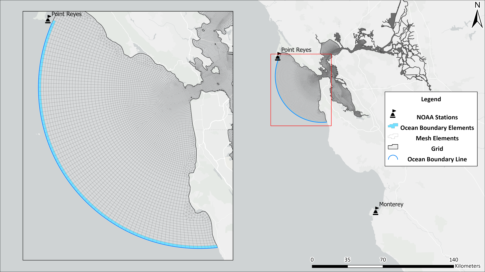

=====================================
Prepare Ocean Boundary (elev2D.th.nc)
=====================================

The ocean boundary relies on elev2D.th.nc for both barotropic and baroclinic runs for historical cases. In the baroclinic case we also specify the u- and v-velocity boundary condition in the uv3D.th.nc file which is generated from the barotropic run (See :ref:`gen_uv3d` for more info on the uv3D.th.nc file generation).

.. note::

    For future scenarios, you could use tidal components to set the ocean boundary. This case is demonstrated in the `bctides.in.3d.tide.yaml example <https://github.com/CADWRDeltaModeling/BayDeltaSCHISM/blob/master/templates/bay_delta/bctides.in.3d.tide.yaml>`_.

The elev2D.th.nc file is a 2D time-varying netCDF file that provides the ocean boundary condition for the model. It contains the elevation (sea surface height) at the ocean boundary over time for each element along the ocean boundary. 

.. _elev2d_boundary:  

   
   Ocean boundary elements shown in blue. The line is specified in `open_boundary.yaml <https://github.com/CADWRDeltaModeling/BayDeltaSCHISM/blob/master/templates/bay_delta/open_boundary.yaml>`_ which gets preprocessed into the `hgrid.gr3` file and is used to interpolate the tide gauge data to the boundary. The resulting `elev2D.th.nc` file has elevation values for each of these boundary elements over time.

The timeseries is interpolated from NOAA's `Monterey <https://tidesandcurrents.noaa.gov/stationhome.html?id=9413450>`_ and `Point Reyes <https://tidesandcurrents.noaa.gov/stationhome.html?id=9415020>`_ tide gauge stations (Fig. :numref:`elev2d_boundary`) using the bdschism utility `gen_elev2d`. You can use this in the command line with `bds gen_elev2d`:

.. click:: gen_elev2d:gen_elev2d_cli
        :prog: bds gen_elev2d
        :show-nested:
