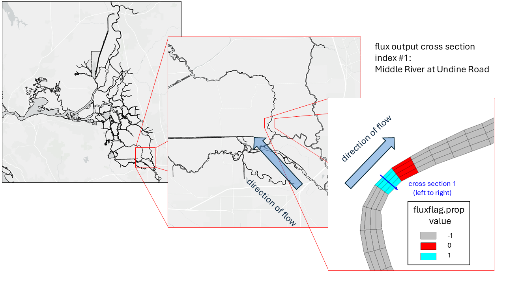

=========
Output
=========

Flavors of output
-----------------

Please refer to `VIMS documentation for full details on different types of SCHISM output <https://schism-dev.github.io/schism/master/input-output/outputs.html>`_. Here we will just briefly describe the different flavors of output and how to request them in the input files.

In short, SCHISM provides two main flavors of output: (1) dense output in netCDF format, and (2) station output in text files. The dense output is written to netCDF files with names like `1_*.nc`, `2_*.nc`, etc. and contains the 2D and 3D variables for the entire model domain at the requested output frequency. The station output is written to text files with names like `staout_1`, `staout_2`, etc. and contains the timeseries of the requested variables at the specific station locations defined in `station.in` at the requested output frequency.


What you should plan in advance
-------------------------------
The `BayDeltaSCHISM template <https://github.com/CADWRDeltaModeling/BayDeltaSCHISM/tree/master/templates/bay_delta>`_ has param.nml files which have the basic outputs for a hindcast model.

It is important to know which variables are needed in your study and follow the guidance below to be sure your variables will be output in the format and frequency you need. It is much easier to set up the output correctly before you run the model than to try to change it after the fact and rerun the model. So we recommend planning your output in advance and adjusting the input files accordingly before you run the model.

Request station output
````````````````````````

In SCHISM you can request output at specific x, y, z locations which will output scalar timeseries at each requested location. You can also request flux outputs across specific lines. The x, y, z point locations are set in `station.in` and the flux lines are set in `fluxflag.prop`.

The output frequencies and types are set in the param.nml file under `Station output option`. There are two variables, similar to the `Global output controls` section, which control the frequency of station output: **iout_sta** and **nspool_sta**. The **iout_sta** variable turns station output on or off, and the **nspool_sta** variable controls how often you get station output in terms of number of time steps. In our template we have:

.. code-block:: none

    ...

    !-----------------------------------------------------------------------
    ! Station output option. If iout_sta/=0, need output skip (nspool_sta) and
    ! a station.in. If ics=2, the cordinates in station.in must be in lon., lat,
    ! and z (positive upward; not used for 2D variables).
    !-----------------------------------------------------------------------
    iout_sta = 1
    nspool_sta = 10 !needed if iout_sta/=0; mod(nhot_write,nspool_sta) must=0
    
    ...

So with **iout_sta** set to 1, we're requesting station output, and **nspool_sta** set to 10, we will get station output every 10 time steps, which is every 15 minutes (10 x 90 seconds = 900 seconds = 15 minutes). So the station output will be more frequent than the global output in this case.

You'll also notice there is no **ihfskip_sta** variable in the `Station output option` section. This is because station output is not written to netCDF files like the global output, but rather is written to text files for each variable. So there is no need to control how many time steps go into each file since there will be one file per variable.

To turn variable output on or off, refer to the first line of `station.in`. See below for more details.

station.in
:::::::::::

The input file `station.in` has the x, y, z locations of the requested station output points. The x and y coordinates are in the same coordinate system as your hgrid.gr3 file (e.g., lat/lon or projected coordinates). The z coordinate is positive upward and is not used for 2D variables. `Our template station.in file <https://github.com/CADWRDeltaModeling/BayDeltaSCHISM/blob/master/templates/bay_delta/station.in>`_ appears as follows:

.. code-block:: none

    1 1 1 1 1 1 1 1 1 1 !elev,air pressure,wind_x,wind_y,temp,salt,u,v,w,ssc
    306
    1 605075.10 4208474.70 -0.50 ! anh2 default "San Joaquin at Antioch"
    2 636491.30 4235314.60 -0.50 ! ben default "Mokelumne River at Benson's Ferry"
    3 609500.30 4239525.40 -0.50 ! ccs default "Cache Slough"
    4 603778.35 4287183.00 -0.50 ! ccy default "Cache Creek at Yolo"
    5 628727.80 4189748.30 -0.50 ! cis default "Old River at Coney Island"
    6 626952.00 4187911.60 -0.50 ! clc default "Clifton Court"
    
    ...

    306 626846.15 4200085.17 -0.50 ! rrcs default "Railroad Cut South"

Where all variables (elev,air pressure,wind_x,wind_y,temp,salt,u,v,w,ssc) are turned on for output (1 means on, 0 means off), and then the x, y, z locations of each station are listed. In this case we have 306 stations requested for output. The first station is the "San Joaquin at Antioch" station with x coordinate of 605075.10, y coordinate of 4208474.70, and z coordinate of -0.50. Following the required data is a comment with the station name z-location (upper, lower, or default) and a description of the station. The commented part of the line is used in schimpy's station output processing to give more informative names to the station output files.

flow_station_xsects.yaml and fluxflag.prop
:::::::::::::::::::::::::::::::::::::::::::

The input file `fluxflag.prop` is generated by `schimpy's prepare_schism preprocessor <https://github.com/CADWRDeltaModeling/schimpy/blob/master/schimpy/prepare_schism.py>`_ using our `template flow_station_xsects.yaml file <https://github.com/CADWRDeltaModeling/BayDeltaSCHISM/blob/master/templates/bay_delta/flow_station_xsects.yaml>`_. The `flow_station_xsects.yaml` file has the x and y coordinates of the endpoints of the requested flux lines and additional station information for each requested line. Here is a snippet of the `flow_station_xsects.yaml` file:

.. code-block:: yaml

    linestrings:
    - agency_id: B95541
    coordinates:
    - - 642050.
        - 4188627.
    - - 642065.
        - 4188614.
    name: MRU
    station_id: MRU
    station_name: Middle River at Undine Road
    - agency_id: B95765
    coordinates:
    - - 647569.275
        - 4186183.19
    - - 647626.29
        - 4185963.26
    name: SJL
    station_id: SJL
    station_name: San Joaquin River near Lathrop
      
    ...

.. warning::
    The fluxflag.prop file is **specific to the horizontal mesh file (hgrid.gr3)** because it is essentially a list of each edge index of the grid and a flag for whether or not to output fluxes across that edge. So if you change your hgrid.gr3 file, you will need to regenerate your fluxflag.prop file using schimpy's prepare_schism preprocessor with the same flow_station_xsects.yaml file.

The `fluxflag.prop` file is a list of each element index of the grid and a flag for which region that element is in. So if you have 1000 elements in your grid, you will have 1000 lines in your `fluxflag.prop` file with the element index and a flag of -1 or `n`. Flux will compute and output flow across a cell edge if (1) the flags at its 2 adjacent elements differ by 1, and (2) neither flag is -1.

In the above example, to compute flow across the "Middle River at Undine Road" station line, the upstream elements would have an index of 1, and the downstream elements would have an index of 0, so the flux across the line would be computed and output. For the "San Joaquin River near Lathrop" station line, the upstream elements would have an index of 3 and the downstream elements would have an index of 2, and so on. The "Middle River at Undine Road" station can be visualized in the below figure, with upstream elements in blue, and downstream elements in red. As you can see, the flux line is drawn from left to right looking downstream.

.. code-block:: none

    11 -1
    2 -1
    3 -1
    4 -1

    ...
    
    509594 -1
    509595 1
    509596 1
    509597 1
    509598 -1

    ...

    509669 2
    509670 1
    509671 -1
    509672 -1
    509673 1
    509674 1
    509675 -1

    ...


.. _fluxflag_prop:  



    Flux line example with fluxflag.prop file. The blue elements have a flag of 1, the red elements have a flag of 0, and the grey elements have a flag of -1. The flux line is drawn from left to right looking downstream, and the flux across the line is computed and output because the flags differ by 1 and neither is -1.

Request dense output (netCDF/\*.nc files)
`````````````````````````````````````````

Dense, or 2D/3D output is written to netCDF files with names like `1_*.nc`, `2_*.nc`, etc. The variables that are output in the dense output files are controlled by the `Global output options` section of the param.nml file. The frequency of the dense output files is controlled by the `Global output controls` section of the param.nml file.

In the `param.nml.clinic file <https://github.com/CADWRDeltaModeling/BayDeltaSCHISM/blob/master/templates/bay_delta/param.nml.clinic>`_ you can see in the `Global output options` which variables are turned 'on' for output.
In our template we have **elevation** and **zCoordinates** turned on which are necessary for plotting in VisIt, as well as **salinity** and **horizontal vel vector**. The default does *not* have temperature turned on. 

.. code-block:: none

    ...
    !-----------------------------------------------------------------------
    ! Global output options
    ! The variable names that appear in nc output are shown in {}
    !-----------------------------------------------------------------------
    iof_hydro(1) = 1 !0: off; 1: on - elev. [m]  {elevation}  2D
    ...
    iof_hydro(18) = 0 !water temperature [C] {temperature}  3D
    iof_hydro(19) = 1 !water salinity [PSU] {salinity}  3D
    ...
    iof_hydro(25) = 1 !z-coord {zCoordinates} 3D - this flag should be on for visIT etc
    iof_hydro(26) = 1 !horizontal vel vector [m/s] {horizontalVelX,Y} 3D vector
    ...

Below the `Global output options` you can see several output options which are only necessary to uncomment (remove "!") when using the relevant module in your SCHISM executable. For example, if you are using the sediment transport module, you will want to uncomment the sediment output options to get sediment output. If you are not using the sediment transport module, then you can leave those options commented out and save on disk space and postprocessing time by not generating unnecessary output.

In the `Global output controls` section you can find two variables, **nspool** and **ihfskip**. The **nspool** variable controls how often you get output in terms of number of time steps. The **ihfskip** variable controls how many timesteps go into an output file. Both of these values are dependent on **dt**. In our template we have:

.. code-block:: none

    ...
    dt = 90. !Time step in sec
    ...
    ! Global output controls
    nspool = 20 !output step spool
    ihfskip = 960 !stack spool; every ihfskip steps will be put into 1_*, 2_*, etc..

This means that for a timestep of *90 seconds*, we will get output every *20* timesteps, which is every *30 minutes* (20 x 90 seconds = 1800 seconds = 30 minutes). And then every *960* timesteps will be put into one output file, which is every *24 hours* (960 x 90 seconds = 86400 seconds = 24 hours). So in this case we would get one output file per day with output every 30 minutes. So each \*_1.nc, \*_2.nc, etc. file would have 48 time steps in it (24 hours / 30 minutes = 48 time steps), and represent a single day of the simulation.

Working with output files
-------------------------

staout\_ files
```````````````

The station output files (staout\_1, staout\_2, etc.) are text files with the station output timeseries for each variable. The variable names for each staout\_ file are listed in the comments of the `station.in` file. 

The staout\_ files correspond to the following variables:

- staout_1 (water surface elevation)
- staout_2 (air pressure)
- staout_3 (wind u)
- staout_4 (wind v)
- staout_5 (water temperature)
- staout_6 (salinity)
- staout_7 (hydro u)
- staout_8 (hydro v)
- staout_9 (hydro w)

The have the format of a headerless file....

.. code-block:: none

    0.900000E+03  0.988777E+000  0.103842E+001  0.990121E+000 ...
    0.180000E+04  0.987857E+000  0.106009E+001  0.102703E+001 ...
    ...

Where the first column is time in seconds since the start of the simulation, and the subsequent columns are the variable values for each station at that time step. So in the above example, at 900 seconds into the simulation, the water surface elevation (staout_1) for station 1 is 0.988777E+000, for station 2 is 0.103842E+001, for station 3 is 0.990121E+000, etc. and there will be a total of 306 columns corresponding to the 306 stations requested for output in the `station.in` file.

flux.out files
````````````````

The flux output is a single varaible output that gives the volumetric flux across each requested line in `fluxflag.prop`. The output is written to a text file called `flux.out` with the following format:

.. code-block:: none

            0.001042     0.6340E-02    -0.2662E+02    -0.1764E+02     ...
            0.002083     0.5863E-02    -0.2134E+02    -0.1773E+02     ...
            0.004167     0.7681E-02    -0.2833E+02    -0.9585E+01     ...
    ...

Where the first column is time in days since the start of the simulation, and the subsequent columns are the volumetric flux across each requested line in `fluxflag.prop`. The output is in units of m/s and the flow lines are drawn left to right.

Visualizing dense (.nc) output in VisIt
````````````````````````````````````````

All \*_1.nc, \*_2.nc, etc. files can be visualized in `VisIt - a LLNL software <https://visit-dav.github.io/visit-website/>`_. SCHISM has adopted VisIt as its main visualization tool, and there are plug-ins so VisIt can understand SCHISM gr3 inputs as well as binary netCDF outputs. 

Here we will give a brief overview of how to visualize the dense output in VisIt, but for more detailed instructions and tips on visualizing SCHISM output in VisIt, please refer to our plug-in manual here:


.. toctree::
  :maxdepth: 5

  visit_manual.rst

SCHISM's extraction utilities
-----------------------------

Our SCHISM utility `schimpy` is a Python package with functions to extract and process SCHISM output files. The `schimpy documentation <https://cadwrdeltamodeling.github.io/schimpy/>`_ has detailed instructions on how to use the various functions in the package to extract and process both the station output files and the dense netCDF output files.

.. warning::
    This section needs updating.

Quick validation plots
----------------------

.. warning::
    This section needs updating.

Where do we keep specialized postprocessing materials?
------------------------------------------------------

.. warning::
    This section needs updating.


