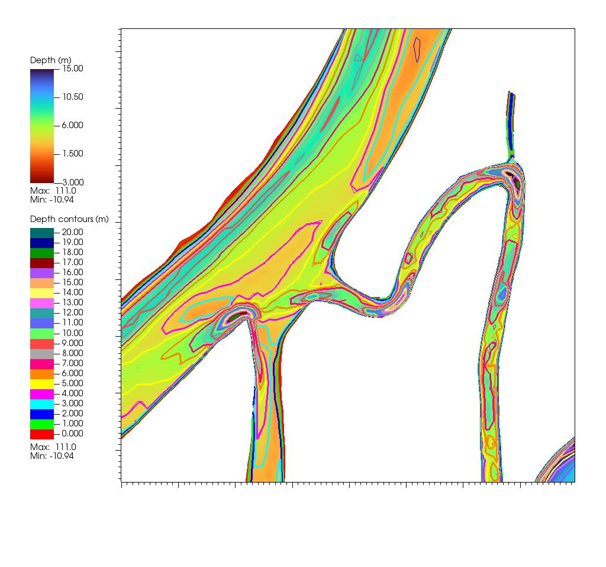
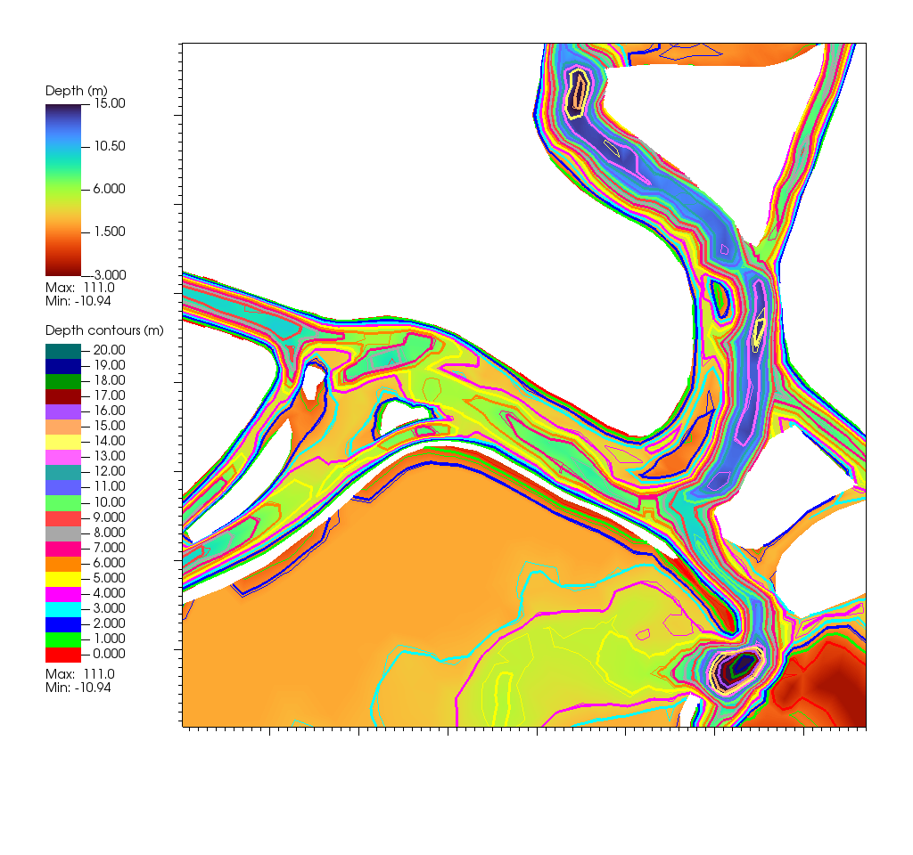

Volumetric Refinement and Smoothing, Depth Enforcement
======================================================

Overview
--------

The volumetric refinement and smoothing procedure lightly adjusts mesh
bathymetry to improve:

* **Volume fidelity** — better alignment between mesh element volumes and DEM
  reference.
* **Smoothness** — elimination of single-node pits and sharp valleys that
  degrade numerical stability.

Typical changes are small (0.1–0.2 m), but isolated pits may be smoothed more.
A shoreline regularization step prevents accidental drying of tidally wetted
areas. After refinement, depth enforcement ensures hydraulic features such as
channels and levees are properly represented where DEMs are incomplete. Removing
unresolved dips and pits also helps prevent switching in the numbers of levels
in a local sigma coordinate mesh, which reduces undulation in the vertical grid. 
For the most part these settings are "set-it-and-forget-it". For a Bay-Delta
mesh we provide reasonable defaults in the preprocessor.

The method is available both as a **standalone script** and as an integrated
step in the **BayDeltaSCHISM preprocessor**.

Mathematical Formulation
------------------------

**Volume fidelity:**

.. math::

   J_\text{vol} = \sum_e \left( V_e(h) - V^\text{DEM}_e \right)^2

**Smoothness (total variation):**

.. math::

   J_\text{TV} = \sum_{(i,j)} \lvert h_i - h_j \rvert

**Combined objective:**

.. math::

   J = \lambda_{L2} J_\text{vol} + \mu J_\text{TV}

where:

* :math:`\lambda_{L2}` controls the weight on **volume fidelity**.
* :math:`\mu` (often referred to as ``tv_weight``) controls the weight on
  **total variation (smoothness)**.

.. note::

   The weights are chosen so that the two terms are **balanced on comparable
   scales**. In practice, this means adjustments to :math:`\lambda_{L2}`,
   ``tv_weight``, and ``l2_weight`` are the most meaningful levers, but these
   are rarely changed once defaults are tuned.

The TV term is non-differentiable at zero. In practice a **subgradient** is
used: rather than a true slope, it provides a proxy direction (raise or lower
a node) that reduces roughness. This simple but powerful idea allows TV
regularization to work in large-scale mesh optimization.

Depth Enforcement
-----------------

Following smoothing, targeted enforcement rules may be applied:

* **Maximum depth (carve channel):**

  .. math::

     h_i = \min(h_i, h_\text{max,poly})

* **Minimum depth (protect levee crest):**

  .. math::

     h_i = \max(h_i, h_\text{min,poly})

These adjustments are applied within polygons or along polylines defined in
the YAML configuration.

Shoreline Discovery Seeds
-------------------------

As part of the shoreline regularization process, **seed points** are used to
identify wetted areas that should remain connected to open water.

* For the Bay-Delta domain, **default seeds** are already embedded in the code
  (specified in **UTM coordinates**).
* For other domains, users must explicitly supply seeds in **deep, reliably
  wetted areas** and update the ``epsg`` field to match their coordinate
  system.

This ensures that shoreline constraints are applied consistently during the
refinement process.

Preprocessor Integration
------------------------

In the BayDeltaSCHISM preprocessor, this step is configured under the
``grid:`` section. Parameters are usually factored into a separate file and
included using the extended YAML ``!include`` syntax.

Example:

.. code-block:: yaml

   grid:
     href:
       name: href.gr3
       default: 0.0
       smooth: true

     depth_optimization:
       method: volume_tvd
       include: depth_opt_params_volume_tvd.yaml

Inline Parameters (Annotated)
-----------------------------

The included file ``depth_opt_params_volume_tvd.yaml`` contains tuned defaults.
For clarity, the main options are shown below with short annotations.

.. code-block:: yaml

   # Target CFL-like condition for stability (0.5–1.0 typical)
   cfl_target: 0.9

   # Initial timestep size for iterations
   dt_init: 1.0

   # Number of optimization iterations
   niter: 25

   # Weight for prioritizing progress on volume fidelity
   lambda_l2: 1.0

   # Weight of total variation (smoothness) term
   tv_weight: 0.5

   # Optional additional L2 regularization weight
   l2_weight: 0.1

   # Clipping tolerance (null disables clipping)
   clip_eps: null

   # Logging level (INFO or DEBUG)
   log_level: INFO

Both this file and the top-level templates (such as
``main_bay_delta.yaml``) are included in the standard BayDeltaSCHISM
distribution.

Examples
--------

Figures below illustrate typical applications.

Sacramento River and Threemile Slough
~~~~~~~~~~~~~~~~~~~~~~~~~~~~~~~~~~~~~

   Optimization removes isolated pits and improves smoothness. Pre-optimization contours are light, post-optimization heavy.

Middle River and northern Mildred Island
~~~~~~~~~~~~~~~~~~~~~~~~~~~~~~~~~~~~~~~~

   Improved volume fidelity and channel continuity. Pre-optimization contours are light, post-optimization heavy.

