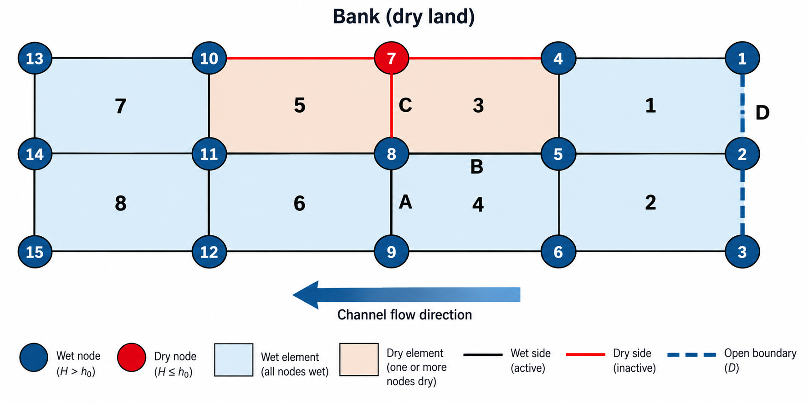

Wetting, Drying, and Fluxes in SCHISM
=====================================

Overview
--------

Wetting and drying allows SCHISM to represent shorelines, tidal flats,
levee slopes, and floodplains whose inundated area changes during a
simulation. Understanding how SCHISM classifies nodes, elements, and
sides is important when interpreting velocity, tracer transport, and
the native ``flux.out`` diagnostic near a moving shoreline.

The key concept is that SCHISM does not impose a new hydrodynamic
boundary condition along the instantaneous wet/dry front. Instead, it
updates the wet/dry state of the fixed mesh as the shoreline moves. As
a result, a side next to a dry element can remain hydrodynamically
active even though tracer exchange across that side is suppressed.
``flux.out`` can also report a volume flux on such a side.

This page explains:

-  how the wet/dry state changes the active numerical domain
-  why hydrodynamic side flux and tracer exchange use different
   eligibility rules
-  how to interpret volume and tracer values in ``flux.out`` near a
   wet/dry front
-  why mesh resolution matters on banks and levee slopes

--------------

Wet/dry side states
-------------------

   Numbered schematic of a wet/dry bank transition and open boundary

The schematic represents a channel flowing from right to left, in the
direction of the arrow. Node and element numbers increase downstream.
Nodes are numbered down each cross-section before continuing to the next
cross-section, and elements are numbered from the bank toward the
channel bed before continuing downstream.

The northern edge is a bank. At **node 7**, the total water depth has
fallen to or below the minimum depth threshold :math:`h_0`. An element
is wet only when the total depth at every one of its nodes is greater
than :math:`h_0`, so **elements 3 and 5**, which contain node 7, are dry
in the state shown. SCHISM then derives the node and side states from the
surrounding element states, as described in
:ref:`wetdry-state-classification`. The figure shows three internal-side
cases and one external-boundary case.

The labels are interpreted as follows:

-  **A**: the side from nodes **8 to 9**, between wet elements **4 and
   6**
-  **B**: the side from nodes **5 to 8**, between dry element **3** and
   wet element **4**
-  **C**: the side from nodes **7 to 8**, between dry elements **3 and
   5**
-  **D**: the open boundary along nodes **1**, **2**, and **3**, adjoining
   wet elements **1 and 2**

The three internal-side states are therefore

.. math::

   A:\text{wet/wet}
   \qquad
   B:\text{wet/dry}
   \qquad
   C:\text{dry}

These cases behave differently in the hydrodynamic solver, tracer
solver, and flux diagnostic. The following sections use the lettered
sides to connect each mesh state to its numerical behavior.

--------------

.. _wetdry-state-classification:

Wetting and drying changes mesh state
-------------------------------------

SCHISM begins the wet/dry classification by comparing the total depth at
the nodes of each element with the specified minimum depth
:math:`h_0`. The total depth is the water-surface elevation plus the
bathymetric depth. The resulting states follow these rules:

-  an element is wet only if the total depth at all of its nodes is
   greater than :math:`h_0`; if any node is at or below the threshold,
   the element is dry
-  a node is wet if at least one surrounding element is wet; otherwise,
   it is dry
-  a side is wet if at least one adjacent element is wet; otherwise, it
   is dry

The classification therefore proceeds from the nodal depth test to the
element state and then back to consistent node and side states. This is
why side **B** in the schematic remains wet: it borders wet element 4.
Side **C** is dry because both of its adjacent elements are dry.

SCHISM then carries wet/dry state through discrete flags used throughout
the code, including element and side flags such as

.. code:: text

   idry_e
   idry_s

The exact shoreline is therefore not represented as a continuously
moving geometric boundary cutting arbitrarily through elements. Instead,
the active numerical domain changes as node, element, and side states
change.

This treatment differs from imposing a natural boundary condition.

At a true open model boundary, normal transport can enter the
finite-element weak form through the boundary term. Schematically,

.. math::

   \int_\Omega \phi_i \nabla\cdot\mathbf U\,d\Omega
   =
   -\int_\Omega \nabla\phi_i\cdot\mathbf U\,d\Omega
   +
   \int_{\partial\Omega}\phi_i\,\mathbf U\cdot\mathbf n\,d\Gamma

A prescribed normal transport on a true external boundary therefore
belongs naturally in the last term.

At the moving wet/dry front, however, SCHISM is **not** creating an
internal boundary on which a new prescribed flux is imposed. Instead, it
is changing which discrete nodes, elements, and sides are active.

For interpretation, treat the bank in the schematic as follows:

   The shoreline is represented by changing state in the fixed mesh, not
   by imposing a special internal Neumann boundary condition that moves
   through the mesh.

--------------

Variable placement
------------------

The interpretation of sides **B** and **C** is easier once the
staggering is remembered.

In SELFE/SCHISM:

-  free-surface elevation is stored at nodes
-  horizontal velocity is stored at side centers
-  tracer in the finite-volume formulation is associated with
   element/prism control volumes

Because the velocity degree of freedom lives on the side, a side can
remain hydrodynamically active even when one neighboring element has
become dry.

That is exactly the situation represented by **B**.

--------------

Case A: ordinary wet/wet side
-----------------------------

Side **A** is the simple case.

Both adjacent elements are wet, and the side itself is wet. SCHISM
therefore:

1. solves the side-centered horizontal velocity
2. constructs a normal volume flux from that velocity
3. allows the TVD tracer solver to exchange tracer between the two
   adjacent wet element control volumes
4. allows ``flux.out`` to integrate the side contribution when it lies
   on a specified flux-region interface

A contribution from the layer face strip bounded by whole levels
:math:`k` and :math:`k+1` has the form

.. math::

   Q_{A,[k,k+1]}
   =
   L_A (z_{k+1}-z_k)
   \frac{u_{n,A,k}+u_{n,A,k+1}}{2}

and the vertically integrated side flux is

.. math::

   Q_A
   =
   L_A\sum_{k=k_{bs}}^{N-1}(z_{k+1}-z_k)
   \frac{u_{n,A,k}+u_{n,A,k+1}}{2}

Thus, the velocities are located at whole levels, while each term in
the sum represents the intervening layer of the vertical side face.
The detailed indexing, including the bottom and surface terms, is
described in :ref:`flux-out-vertical-integration`.

Side A therefore represents ordinary interior transport between two
active water volumes.

--------------

Case B: wet side with one dry neighbor
--------------------------------------

This case requires care when interpreting fluxes.

Assume

.. math::

   idry_s(B)=0

while one neighboring element is wet and the other is dry:

.. math::

   idry_e(E_{\rm wet})=0
   \qquad
   idry_e(E_{\rm dry})=1

Hydrodynamics at B
^^^^^^^^^^^^^^^^^^

The hydrodynamic code only zeros horizontal side velocity when the
**side itself** is dry.

In ``schism_step(6).F90``, the side loop contains the logic

.. code:: fortran

   if(idry_s(j)==1) then
     do k=1,nvrt
       su2(k,j)=0.d0
       sv2(k,j)=0.d0
     enddo
     cycle
   endif

   ! Wet sides

So if **B** is a wet side, SCHISM continues into the hydrodynamic side
calculation.

This means

.. math::

   \boxed{\mathbf u_B \text{ is an active hydrodynamic velocity degree of freedom}}

and it need not be zero.

The pressure-gradient reconstruction also treats the available wet
neighboring element separately from a dry neighboring element. A wet/dry
side is therefore not automatically shut down simply because one
adjoining element is dry.

A geometric side-volume flux can consequently be formed:

.. math::

   Q_B
   =
   L_B\sum_{k=k_{bs}}^{N-1}(z_{k+1}-z_k)
   \frac{u_{n,B,k}+u_{n,B,k+1}}{2}

This quantity can be nonzero.

Interpreting volume flux at B
^^^^^^^^^^^^^^^^^^^^^^^^^^^^^

A nonzero :math:`Q_B` should not automatically be interpreted as

   water is being conservatively transferred from the currently wet
   element into the currently dry element as though both were active
   finite-volume cells

That is not what the TVD tracer solver does.

The hydrodynamic side velocity and finite-volume tracer exchange have
different eligibility rules.

--------------

Tracer transport at B
---------------------

The explicit TVD transport routine first constructs horizontal advective
water fluxes for wet sides.

In ``transport_TVD.F90.0``, the side loop begins with

.. code:: fortran

   if(idry_s(j)==1) cycle

and then forms

.. code:: fortran

   flux_adv_hface(k,j)

from side-normal velocity multiplied by the vertical face area.

Thus a B-type side can have a defined hydrodynamic face flux in the
transport routine.

However, when the tracer update loops around the faces of a wet element,
it checks the neighboring element:

.. code:: fortran

   iel=ic3(j,i)

   if(iel/=0) then
     if(idry_e(iel)==1) cycle
     trel_tmp_outside(:)=trel_tmp(:,k,iel)
   ...
   endif

That ``cycle`` is decisive.

If the neighboring element is dry, the tracer solver skips that face
before the inflow/outflow tracer update is applied.

Therefore, while the opposite element remains dry,

.. math::

   \boxed{\text{horizontal tracer exchange across B}=0}

There is not a one-sided operation in which the wet donor loses tracer
mass while the dry receiver receives nothing.

In particular, SCHISM is **not** doing

.. math::

   M_{\rm wet}^{n+1}
   =
   M_{\rm wet}^n
   -
   Q_B C \Delta t

while simultaneously doing

.. math::

   M_{\rm dry}^{n+1}
   =
   M_{\rm dry}^n

That would be an obvious mass sink. The code avoids that by skipping the
face in the tracer exchange when the neighboring element is dry.

The higher-order TVD limiter also explicitly requires two wet
neighboring elements. Its logic skips a side when either neighboring
element is dry.

So **B is hydrodynamically active but is not an active wet-to-wet tracer
exchange face**.

WENO and implicit-vertical transport
^^^^^^^^^^^^^^^^^^^^^^^^^^^^^^^^^^^^

The alternative transport implementation preserves the same horizontal
wet/dry distinction. It uses **implicit TVD in the vertical and explicit
TVD in the horizontal**. The WENO option (``itr_met==4``) changes the
horizontal reconstruction, but when the neighboring element is dry the
face is skipped before tracer exchange is performed.

For the explicit TVD, WENO, and implicit-vertical/TVD-horizontal paths,
a B-type side can therefore retain a hydrodynamic face flux while
horizontal tracer exchange with the dry neighboring element is omitted.
Here, *implicit* describes the vertical treatment; it does not imply an
implicit horizontal transfer across B.

--------------

Case C: dry side
----------------

Side **C** represents the stronger form of exclusion.

If

.. math::

   idry_s(C)=1

then the hydrodynamic side velocity is explicitly zeroed:

.. math::

   u_C=v_C=0

and the side is skipped in the relevant flux calculations.

So for **C**:

.. math::

   \boxed{\text{hydrodynamic side transport}=0}

.. math::

   \boxed{\text{TVD tracer exchange}=0}

.. math::

   \boxed{\text{native volume flux.out contribution}=0}

This is very different from **B**.

--------------

Case D: a true open boundary
----------------------------

Case **D**, shown at the right edge of the schematic, is a true model
boundary. It is fundamentally different from either **B** or **C**.

For a prescribed-flow open boundary, SCHISM computes the wetted boundary
cross-sectional area using wet boundary sides, and the prescribed
transport is distributed over that area.

The code includes logic of the form

.. code:: fortran

   if(idry_s(isd0)==0) then
     carea = carea + htot*distj(isd0)
   endif

and later, for prescribed flow,

.. code:: fortran

   vnth0=qthcon(ibnd)*ramp/carea(ibnd)

The corresponding normal velocity is imposed on the wet boundary sides.

Dry open-boundary sides are instead set to zero velocity.

This is the appropriate context in which to talk about an imposed
normal-flow or natural boundary condition.

In short:

   **D is a boundary-condition problem. B and C are wet/dry-state
   problems.**

Keep this distinction in mind when comparing prescribed boundary flow
with fluxes near an inundation front.

--------------

How ``flux.out`` calculates volume flux
---------------------------------------

.. _flux-out-vertical-integration:

The native flux diagnostic in ``schism_step(6).F90`` does not
reconstruct a weak-form boundary term. It directly integrates solved
side velocity over side area.

The relevant code excludes

.. code:: fortran

   if(idry_s(i)==1.or.isdel(2,i)==0) cycle

so it requires:

-  a wet side
-  an internal side with two mesh-neighbor element indices

It then forms the layer contribution

.. code:: fortran

   vnn=(su2(k+1,i)+su2(k,i))/2*snx(i)
      +(sv2(k+1,i)+sv2(k,i))/2*sny(i)

   ftmp=fac*distj(i)*(zs(k+1,i)-zs(k,i))*vnn

Here ``su2`` and ``sv2`` are located at the side center horizontally and
at whole levels vertically. There is consequently one more whole-level
velocity than there are vertical layer face strips on an active side.
In the equations below, :math:`k` is the lower whole-level index, and
:math:`[k,k+1]` denotes the intervening strip of the vertical prism
face. It does not denote a velocity located at a layer center.

Projecting the velocities at the two bounding whole levels onto the
side normal gives

.. math::

   u_{n,k}=u_k n_x+v_k n_y,

and the code uses their arithmetic mean for the layer:

.. math::

   \overline{u}_{n,k+1/2}
   =
   \frac{u_{n,k}+u_{n,k+1}}{2}.

The contribution from that layer face strip is therefore

.. math::

   Q_{[k,k+1]}
   =
   L\,(z_{k+1}-z_k)
   \frac{u_{n,k}+u_{n,k+1}}{2}.

This is the trapezoidal rule applied to the vertical integral of normal
velocity over one strip of the prism face. Equivalently, it is the strip
area :math:`L(z_{k+1}-z_k)` multiplied by the arithmetic mean of the two
bounding whole-level velocities.

For a wet side, ``kbs(i)`` is its lowest active whole-level index and
``nvrt`` is the surface whole-level index. The ``flux.out`` loop uses
``k = kbs(i), ..., nvrt-1``. The first term therefore spans whole levels
``kbs(i)`` and ``kbs(i)+1``; the last spans ``nvrt-1`` and ``nvrt``.
There are ``nvrt-kbs(i)`` layer face strips, one fewer than the
``nvrt-kbs(i)+1`` whole-level velocities used to bound them.

The routines index these strips differently: ``flux.out`` uses the lower
whole-level index ``k``, whereas the TVD transport routines use the upper
index ``k`` for the strip bounded by ``k-1`` and ``k``. This is only an
indexing shift. A dry side is excluded before the ``flux.out`` loop. If
an interval has zero thickness, its contribution is zero; if no interval
is present, the sum is empty. True external boundary sides are also
excluded from this native internal-side diagnostic and are handled
through the boundary-condition machinery described for case **D**.

The native volume diagnostic therefore measures a geometric transport
associated with the solved side velocity.

Crucially, the code does **not** additionally require both neighboring
elements to be wet.

Therefore:

.. math::

   \boxed{\text{A contributes to volume flux.out}}

.. math::

   \boxed{\text{B can contribute to volume flux.out}}

.. math::

   \boxed{\text{C does not contribute to volume flux.out}}

Consequently, a reported volume flux does not by itself establish that
two wet tracer control volumes exchanged mass across the side.

--------------

10. Why B can appear in ``flux.out`` even though TVD tracer transport skips it
------------------------------------------------------------------------------

For a B-type side:

.. math::

   idry_s=0

so ``flux.out`` treats it as a wet internal side and integrates

.. math::

   Q_B=L_B\int u_{n,B}\,dz

But the tracer update asks an additional question:

   Is the neighboring tracer control volume wet?

If the answer is no, it skips the exchange.

So the two operations answer different questions.

``flux.out`` asks approximately:

   What normal volume flux is implied by the solved velocity field on
   this wet side?

The tracer update asks:

   Is there an active neighboring finite-volume tracer cell with which
   this wet cell can exchange tracer mass?

Those are not the same criterion.

This is why a nonzero ``flux.out`` value at a wet/dry interface should
not automatically be interpreted as conservative exchange between two
currently active water volumes.

--------------

11. Native tracer flux in ``flux.out``
--------------------------------------

When tracer flux output is enabled, ``flux.out`` takes the same
diagnostic water flux ``ftmp`` and multiplies it by an upwind element
tracer concentration.

Schematically,

.. math::

   F_C^{\rm flux.out}
   =
   Q\,C_{\rm upwind}

The implementation uses the tracer value from one element when the side
flux is positive and from the other when it is negative.

This is a diagnostic calculation.

It is **not** the same numerical operation as the prognostic TVD tracer
update, which includes:

-  wet/dry control-volume eligibility
-  transport subcycling
-  TVD limiting where appropriate
-  diffusion
-  body-source terms
-  vertical fluxes
-  open-boundary tracer logic

The distinction becomes particularly important at B-type wet/dry
interfaces because the diagnostic can still form
:math:`Q C_{\rm upwind}` even though the finite-volume tracer update
skips wet-to-dry exchange across that face.

--------------

12. Rewetting and tracer state
------------------------------

The transport source contains the comment

.. code:: fortran

   For rewetted elements, tr_el takes the value from last wet step

This indicates that a newly rewetted element does not receive its
initial concentration through a preceding B-face tracer transfer while
it was still dry. Instead, its tracer state is restored from its
previous wet state.

This is another reason to distinguish:

1. the hydrodynamic motion of the wet/dry front
2. the side-velocity-derived diagnostic flux
3. finite-volume tracer exchange between active wet cells
4. tracer state assigned when an element becomes wet again

The supplied source is sufficient to establish those separate code
paths.

It is **not** sufficient, by itself, to prove an exact machine-precision
global tracer-mass identity through every wet-to-dry and dry-to-wet
state transition. A definitive proof of that would require tracing the
routines that update the wet/dry masks and the element state during
rewetting.

--------------

13. Unit-tracer thought experiment
----------------------------------

A useful diagnostic is a conservative tracer initialized everywhere to

.. math::

   C=1

For an ordinary active wet/wet face,

.. math::

   F_C
   =
   Q C
   =
   Q

so the advective tracer flux and volume flux are numerically equivalent
in units apart from the interpretation of the transported quantity.

At a B-type wet/dry face, however, the distinction becomes revealing:

-  a hydrodynamic side velocity can exist
-  ``flux.out`` can report :math:`Q_B`
-  native diagnostic tracer flux can form :math:`Q_B C_{\rm upwind}`
-  the tracer solvers examined here do not exchange tracer into the dry
   neighboring element

Thus even a unit tracer does **not** imply that every native side-flux
diagnostic and every prognostic tracer transfer will match at the
instantaneous wet/dry front.

The unit-tracer case is still useful because it removes concentration
gradients from the problem and exposes the wet/dry bookkeeping directly.

--------------

14. Hydrodynamic conservation versus interpreting a single B-side flux
----------------------------------------------------------------------

The original SELFE formulation emphasizes use of the primitive
continuity equation and finite-volume definitions of volume when
assessing conservation.

That should not be confused with the stronger claim that every nonzero
side velocity at the edge of the active element set can be interpreted
independently as conservative transfer into an active neighboring cell.

At B, the hydrodynamic solver carries a valid side velocity degree of
freedom as part of the coupled free-surface and momentum solution. The
complete hydrodynamic solution, moving free surface, vertical fluxes,
and evolving wet/dry state determine the volume balance.

Therefore the safe interpretation is:

   **B has a real hydrodynamic velocity and a real velocity-derived
   geometric flux, but while the neighboring element is dry it is not an
   ordinary two-cell conservative tracer exchange face.**

That statement is directly consistent with the source paths inspected
here.

--------------

15. Why fine discretization on levee slopes remains important
-------------------------------------------------------------

The moving shoreline is represented discretely.

As water levels rise or fall, a node can change wet/dry state, which can
in turn alter the state of neighboring elements and sides. On a coarse
levee slope, one such transition can represent a relatively large change
in:

-  horizontal shoreline position
-  elevation
-  active wetted area
-  storage volume
-  cross-sectional conveyance
-  which sides fall into A-, B-, or C-type behavior

With finer cross-slope resolution, these discrete transitions represent
smaller physical increments.

A useful way to state the motivation is:

   **Fine discretization across wetting/drying slopes reduces the
   spatial, vertical, and cross-sectional quantization associated with
   discrete node, element, and side state changes as the shoreline
   migrates.**

It also reduces the physical scale represented by B-type interface sides
for which hydrodynamic velocity can remain active even though the
neighboring tracer control volume is dry.

That provides a numerical reason, beyond simple bathymetric fidelity,
for refining levee and bank slopes where wetting and drying is
important.

--------------

16. Final interpretation table
------------------------------

+-------+-------+----------+----------+----------+----------+-------+
| Case  | Mesh  | Hydr     | G        | TVD      | Native   | Inte  |
|       | state | odynamic | eometric | tracer   | volume   | rpret |
|       |       | side     | side     | exchange | ``fl     | ation |
|       |       | velocity | volume   |          | ux.out`` |       |
|       |       |          | flux     |          |          |       |
+=======+=======+==========+==========+==========+==========+=======+
| **A** | wet   | Yes      | Yes      | Yes      | Yes      | Ord   |
|       | side, |          |          |          |          | inary |
|       | we    |          |          |          |          | int   |
|       | t/wet |          |          |          |          | erior |
|       | neig  |          |          |          |          | tran  |
|       | hbors |          |          |          |          | sport |
|       |       |          |          |          |          | face  |
+-------+-------+----------+----------+----------+----------+-------+
| **B** | wet   | **Yes**  | **Pot    | **No     | **Yes,   | A     |
|       | side, |          | entially | while    | if the   | ctive |
|       | one   |          | n        | neighbor | di       | hy    |
|       | wet   |          | onzero** | remains  | agnostic | drody |
|       | and   |          |          | dry**    | transect | namic |
|       | one   |          |          |          | uses the | side  |
|       | dry   |          |          |          | side**   | at    |
|       | nei   |          |          |          |          | m     |
|       | ghbor |          |          |          |          | oving |
|       |       |          |          |          |          | we    |
|       |       |          |          |          |          | t/dry |
|       |       |          |          |          |          | front |
+-------+-------+----------+----------+----------+----------+-------+
| **C** | dry   | No;      | No       | No       | No       | Ina   |
|       | side  | zeroed   |          |          |          | ctive |
|       |       |          |          |          |          | side  |
+-------+-------+----------+----------+----------+----------+-------+
| **D** | true  | Yes,     | Yes      | B        | Separate | A     |
|       | ext   | a        |          | oundary- | boundary | ctual |
|       | ernal | ccording |          | specific | case     | loc   |
|       | open  | to BC    |          | tracer   |          | ation |
|       | bou   |          |          | t        |          | for   |
|       | ndary |          |          | reatment |          | im    |
|       |       |          |          |          |          | posed |
|       |       |          |          |          |          | tr    |
|       |       |          |          |          |          | anspo |
|       |       |          |          |          |          | rt/na |
|       |       |          |          |          |          | tural |
|       |       |          |          |          |          | BC    |
+-------+-------+----------+----------+----------+----------+-------+

--------------

17. Final code-path table
-------------------------

+-----------------+-----------------+-----------------+-----------------+
| Question        | Hydrodynamics   | TVD transport   | ``flux.out``    |
+=================+=================+=================+=================+
| Is a dry side   | No; velocity is | No              | No              |
| used?           | zeroed          |                 |                 |
+-----------------+-----------------+-----------------+-----------------+
| Can a wet side  | **Yes**         | Face water flux | **Yes**         |
| with one dry    |                 | can be formed,  |                 |
| neighboring     |                 | but horizontal  |                 |
| element remain  |                 | tracer exchange |                 |
| active?         |                 | is skipped      |                 |
+-----------------+-----------------+-----------------+-----------------+
| Are both        | Not for the     | **Yes for the   | **No**          |
| neighboring     | side velocity   | ordinary        |                 |
| elements        | itself          | interior        |                 |
| required to be  |                 | horizontal      |                 |
| wet?            |                 | tracer exchange |                 |
|                 |                 | examined here** |                 |
+-----------------+-----------------+-----------------+-----------------+
| Is the quantity | **No**          | No              | No              |
| a prescribed    |                 |                 |                 |
| we              |                 |                 |                 |
| t/dry-interface |                 |                 |                 |
| boundary flux?  |                 |                 |                 |
+-----------------+-----------------+-----------------+-----------------+
| Can it          | Only at a true  | Bo              | Not the same    |
| represent a     | model boundary  | undary-specific | operation       |
| true imposed    |                 | treatment       |                 |
| external flow   |                 |                 |                 |
| BC?             |                 |                 |                 |
+-----------------+-----------------+-----------------+-----------------+
| Is native       | —               | —               | **No**          |
| tracer          |                 |                 |                 |
| ``flux.out``    |                 |                 |                 |
| identical to    |                 |                 |                 |
| prognostic TVD  |                 |                 |                 |
| tracer          |                 |                 |                 |
| transport?      |                 |                 |                 |
+-----------------+-----------------+-----------------+-----------------+

--------------

Compact summary
---------------

For the four cases shown in the figure, the most concise interpretation
is:

.. math::

   \boxed{
   A:\ \text{hydro yes,\ tracer yes,\ flux.out yes}
   }

.. math::

   \boxed{
   B:\ \text{hydro yes,\ tracer exchange no,\ flux.out yes}
   }

.. math::

   \boxed{
   C:\ \text{hydro no,\ tracer no,\ flux.out no}
   }

The external case **D** is a true boundary-condition location:

.. math::

   \boxed{
   D:\ \text{true boundary-condition location}
   }

The conceptual distinction to retain is:

   **The wet/dry front is represented by changing discrete state in the
   mesh. SCHISM is not imposing a moving internal natural boundary
   condition along that front.**

--------------

19. Source basis
----------------

This note is based on the supplied files:

-  ``schism_step(6).F90``
-  ``transport_TVD.F90.0``
-  ``transport_TVD_imp.F90``
-  Zhang and Baptista (2008), *SELFE: A semi-implicit
   Eulerian–Lagrangian finite-element model for cross-scale ocean
   circulation*
-  the supplied numbered A/B/C schematic
   (``img/wet_dry_channel_example.png``)

Relevant source locations inspected include:

-  ``schism_step(6).F90``, approximately lines 6460–6650: wet-side
   momentum handling and zeroing of dry-side velocities
-  ``schism_step(6).F90``, approximately lines 8965–9020: native
   ``flux.out`` calculation
-  ``schism_step(6).F90``, approximately lines 2000–2100: open-boundary
   wetted-area and prescribed-flow logic
-  ``transport_TVD.F90.0``, approximately lines 110–170: horizontal
   advective face-flux construction
-  ``transport_TVD.F90.0``, approximately lines 295–335: requirement for
   two wet elements in the TVD limiter
-  ``transport_TVD.F90.0``, approximately lines 850–970: actual
   horizontal tracer update and skip of dry neighboring elements
-  ``transport_TVD_imp.F90``, opening comments: implicit TVD vertically
   and explicit TVD horizontally
-  ``transport_TVD_imp.F90``, WENO branch near lines 270–730: WENO
   horizontal reconstruction and skip of a dry neighboring element
-  ``transport_TVD_imp.F90``, later horizontal update near lines
   1300–1330: dry-neighbor skip in the horizontal tracer update

One remaining source-level question, if a formal conservation audit is
needed, is the exact sequence by which the current SCHISM version
updates ``idry_e``, ``idry_s``, element volume, and restored tracer
state during a wet/dry transition. The files examined here establish the
side and transport behavior summarized above, but they do not by
themselves provide the full mask-update routine needed for a complete
proof of tracer-mass conservation through rewetting.
